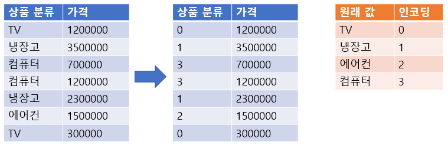
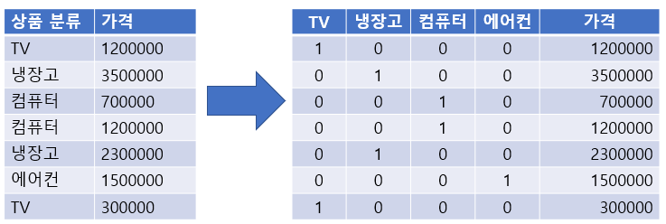

# 결측치 처리
- 결측치 (Not Available - NA, nan, None)
    -수집하지 못한 값, 모르는 값.
- 머신러닝 알고리즘은 Feature에 결측치가 있는 경우 처리를 하지 못함

<br>

- 결측치를 처리를 해주어야 함
    1. 결측치 제거
        - 보통은 행을 기준으로 제거
        - 특정 열(컬럼)에 결측치가 많을 경우에는 열 단위로 제거
        
    2. 다른값을 대체
        - 가장 가능성이 높은 값
            - 수치형 : 평균(정규분포), 중앙값
            - 범주형 : 최빈값(가장 많이 나온 값)
            - 결측치를 추론하는 머신러닝 알고리즘을 사용 
        - 결측치를 표현하는 값을 만들어서 대체
        
- 데이터 양이 충분하면 제거하는 것이 우선
- 데이터의 양이 적은 경우 다른 값을 대체

- 코드 (결측치 제거)
    ```python
    import pandas as pd
    
    cols = ['age', 'workclass','fnlwgt','education', 'education-num', 'marital-status', 'occupation','relationship', 'race', 'gender','capital-gain','capital-loss', 'hours-per-week','native-country', 'income']

    data = pd.read_csv('data/adult.data',
                    header=None, # 첫번째 행이 데이터이기 때문에 header=None(헤더없음)으로 설정
                    names = cols,
                    na_values="?",
                    skipinitialspace=True # 앞의 공백 제거
                  )


    # 결측치 제거
    data.dropna(axis=0) # 결측치가 있는 행 전체 삭제
    data.dropna(axis=1) # 결측치가 있는 열 전체 삭제
    data.dropna(axis=0, inplace=True) # dropna가 적용된 DataFrame 자체에 dropna를 적용
    data.dropna(axis=0, inplace=False) #  dropna가 적용된 DataFrame는 그대로 두고 dropna를 적용한 DataFrame을 return
    data.isnull().sum()
    ```


<br>
<hr>
<br>

# 범주형 데이터 전처리
- 사이킷런은 문자열 값을 처리 하지 않기 때문에 input이나 output data가 문자열일 경우 숫자 형으로 변환
    - 보통은 정수로 변환

<br>
<hr>
<br>

## 범주형 변수(Categorical Variable)
- 몇 개의 범주 중 하나에 속하는 값들로 구성된 변수
- 어떤 분류에 대한 속성을 가지는 변수를 의미
    - 예) 성별 - 남/녀, 혈액형 - A, B, AB, O, 성적 - A,B,C,D,F

<br>

- 비서열(Unordered) 변수 
    - 범주에 속한 값간에 서열(순위)가 없는 변수
    - 성별, 혈액형

<br>

- 서열 (Ordered) 변수
    - 범주에 속한 값 간에 서열(순위)가 있는 변수
    - 성적, 직급

<br>

- 사이킷런은 문자열 값을 처리 하지 않기 때문에 input이나 output data가 문자열일 경우 숫자 형으로 변환
    - **범주형 변수의 경우** 전처리를 통해 정수값으로 변환
    - 범주형이 아닌 **단순 문자열인** 경우 일반적으로 제거

<br>
<hr>
<br>


## 범주형 Feature의 처리
- Label Encoding
    - 숫자의 차이가 모델에 영향을 주지 않는 경우 사용

    <br>

- One hot Encoding 
    - 숫차의 차이가 모델에 영향을 주는 경우 사용


<br>
<hr>
<br>

## 레이블 인코딩(Label encoding)

- 문자열(범주형) 값을 오름차순 정렬 후 0 부터 1씩 증가하는 값으로 변환

<br>

- **숫자의 차이가 모델에 영향을 주지 않는 트리 계열 모델(의사결정나무, 랜덤포레스트)에 적용**
- **숫자의 차이가 모델에 영향을 미치는 선형 계열 모델(로지스틱회귀, SVM, 신경망)에는 사용하면 안됨**

    <p align="center"><p>


<br>

- **sklearn.preprocessing.LabelEncoder**
    - fit()
        - 어떻게 변환할 지 학습, (0, 1, 2, .. 어떤 수로 변환할지)
    - transform()
        - 문자열를 숫자로 변환 (실제로 0, 1, 2, .. 로 변환)
    - fit_transform()
        - 학습과 변환을 한번에 처리
    - inverse_transform()
        - 숫자를 문자열로 변환
    - classes_ 
        -인코딩한 클래스 조회

<br>

- 코드
    ```python
    import numpy as np
    import pandas as pd
    from sklearn.preprocessing import LabelEncoder

    cols = ['age', 'workclass','fnlwgt','education', 'education-num', 'marital-status', 'occupation','relationship', 'race', 'gender','capital-gain','capital-loss', 'hours-per-week','native-country', 'income']

    data = pd.read_csv('data/adult.data',
                    header= None, # 첫번째 행이 데이터이기 때문에 header=None(헤더없음)으로 설정
                    names=cols,
                    na_values="?",
                    skipinitialspace=True # 앞의 공백 제거
                    )

    adult_data = data.copy()

    enc_dict = {} # 빈 dictionary
    # inverse 하기 위함

    for col in encoding_columns:
        le = LabelEncoder()
    #     adult_data[col] = le.fit_transform(adult_data[col])
        adult_data[col] = le.fit_transform(adult_data[col].astype(str))
        enc_dict[col] = le.classes_

    # 예전에는 결측치가 있어도 적용이 되었는데 지금은 안됨
    # TypeError: Encoders require their input to be uniformly strings or numbers. Got ['float', 'str'] 발생
    # adult_data[col] = le.fit_transform(adult_data[col].astype(str)) 로 수정.
    # 또는 adult_data.dropna(inplace=True) 하여 결측치 제거 후 시도

    ```

- 코드 (DataFrame.apply 적용)
    ```python
    data = pd.read_csv('data/adult.data',
                  header= None, # 첫번째 행이 데이터이기 때문에 header=None(헤더없음)으로 설정
                  names=cols,
                  na_values="?",
                  skipinitialspace=True # 앞의 공백 제거
                  )
    
    adult_data = data.copy()

    enc_dict2 = {}
    def label_encoder(column):
        le = LabelEncoder()
        encoded_value = le.fit_transform(column.astype(str))
        enc_dict2[column.name] = le.classes_
        return encoded_value

    enc_df = data[encoding_columns].apply(label_encoder)

    adult_data2 = enc_df.join(data[not_encoding_columns])
    ```

<br>
<hr>
<br>

## 원핫 인코딩(One-Hot encoding)
- N개의 클래스를 N 차원의 One-Hot 벡터로 표현되도록 변환
    - 고유값들을 피처로 만들고 정답에 해당하는 열은 1로 나머진 0으로 표시
        - 대부분이 0으로만 구성됨 (희소행렬)
    - 고유값들의 수가 많아지면 피처의 수도 증가, 즉 고유값의 수만큼 column이 늘어남

    <br>

- 숫자의 차이가 모델에 영향을 미치는 선형 계열 모델(로지스틱회귀, SVM, 신경망)에서 범주형 데이터 변환시 라벨 인코딩 보다 원핫 인코딩 사용
    - 즉 사용할 모델에 따라 label, one-hot 중 선택
    - 일반적으로 트리형 모델 제외하고는 one-hot encoding을 사용

    <br>

    <p align="center"><p>


<br>

- **사이킷런**
    - sklearn.preprocessing.OneHotEncoder 이용
        - fit(): 어떻게 변환할 지 학습
        - transform(): 문자열를 숫자로 변환
        - fit_transform(): 학습과 변환을 한번에 처리
        - fit/transform/fit_transform 할 때 2차원배열(axis=0을 기준으로 변환), 한번에 여러개 칼럼을 변환할 수 있음
        - get_feature_names() : 원핫인코딩으로 변환된 컬럼의 이름을 반환

        <br>

    - DataFrame을 넣을 경우 모든 변수들을 변환
        - 범주형 컬럼만 처리하도록 해야 함

    <br>


- 코드 1
    ```python
    import numpy as np
    import pandas as pd
    from sklearn.preprocessing import OneHotEncoder

    items = np.array(['TV', '냉장고', '냉장고','컴퓨터', '에어콘', '컴퓨터', '에어콘'])
    # list 인 경우는 안됨 

    ohe = OneHotEncoder()
    ohe.fit(items)
    rv = ohe.transform(items)
    ##  Expected 2D array, got 1D array instead 발생

    ```

<br>

- 코드 2
    ```python
    import numpy as np
    import pandas as pd
    from sklearn.preprocessing import OneHotEncoder

    items = np.array(['TV', '냉장고', '냉장고','컴퓨터', '에어콘', '컴퓨터', '에어콘'])

    src_items = items[..., np.newaxis]
    ohe = OneHotEncoder()
    ohe.fit(src_items)
    rv = ohe.transform(src_items)

    rv # <7x4 sparse matrix of type '<class 'numpy.float64'>' with 7 stored elements in Compressed Sparse Row format>
    print(type(rv)) # <class 'scipy.sparse.csr.csr_matrix'>
    # 희소행렬 객체
    # 메모리를 아끼기 위한 방식

    rv.toarray()
    # csr_matrix를 ndarray 형태로 변환해줌
    ```

- 코드 3
    ```python

    import numpy as np
    import pandas as pd
    from sklearn.preprocessing import OneHotEncoder

    items = np.array(['TV', '냉장고', '냉장고','컴퓨터', '에어콘', '컴퓨터', '에어콘'])

    src_items = items[..., np.newaxis]
    ohe = OneHotEncoder(sparse=False) 
    # sparse = False -> 처리결과를 바로 npdarray 형태로 제공
    ohe.fit(src_items)
    rv2 = ohe.transform(src_items)

    ```

- 코드 4
    ```python
    import numpy as np
    import pandas as pd
    from sklearn.preprocessing import LabelEncoder, OneHotEncoder

    # adult.data 읽어오기
    cols = ['age', 'workclass','fnlwgt','education', 'education-num', 'marital-status', 'occupation','relationship', 'race', 'gender','capital-gain','capital-loss', 'hours-per-week','native-country', 'income']

    adult_df = pd.read_csv('data/adult.data',
                    header= None, # 첫번째 행이 데이터이기 때문에 header=None(헤더없음)으로 설정
                    names=cols,
                    na_values="?",
                    skipinitialspace=True # 앞의 공백 제거
                    )

    # 결측치 처리
    adult_df.dropna(inplace=True)

    # 인코딩 처리
    ohe = OneHotEncoder(sparse=False)
    return_value = ohe.fit_transform(adult_df[['workclass','education', 'occupation', 'gender']]) 

    r_df = pd.DataFrame(return_value, columns= ohe.get_feature_names())
    ```


- **Pandas**
    - pandas.get_dummies(DataFrame [, columns=[변환할 컬럼명]]) 함수 이용
    - DataFrame에서 범주형(`object`, `category`) 변수만 변환
    - object 는 인코딩을 하지만 **숫자는 유지**
    
    <br>
    
    > 범주형 변수의 값을 숫자 값 가지는 경우 (ex: 별점)    
    > 이런 경우 get_dummies() columns=['컬럼명','컬럼명'] 매개변수로 컬럼들을 명시

    <br>

    - 코드
    ```python
    import numpy as np
    import pandas as pd
    from sklearn.preprocessing import LabelEncoder, OneHotEncoder

    # adult.data 읽어오기
    cols = ['age', 'workclass','fnlwgt','education', 'education-num', 'marital-status', 'occupation','relationship', 'race', 'gender','capital-gain','capital-loss', 'hours-per-week','native-country', 'income']

    adult_df = pd.read_csv('data/adult.data',
                    header= None, # 첫번째 행이 데이터이기 때문에 header=None(헤더없음)으로 설정
                    names=cols,
                    na_values="?",
                    skipinitialspace=True # 앞의 공백 제거
                    )

    X = pd.get_dummies(adult_df[adult_df.columns[:-1]])
    ```