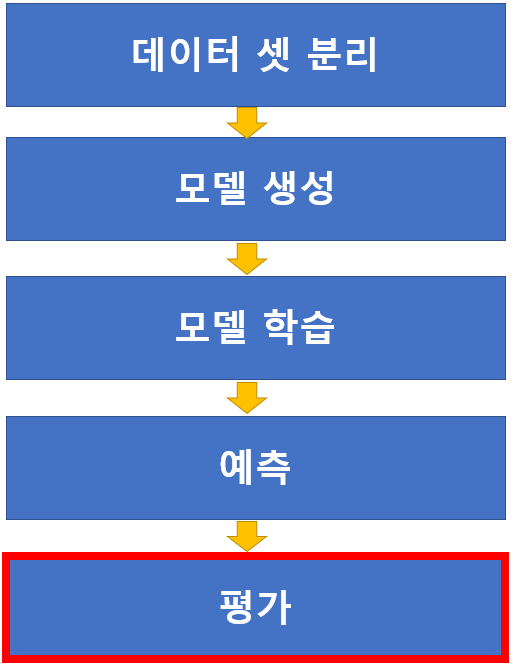
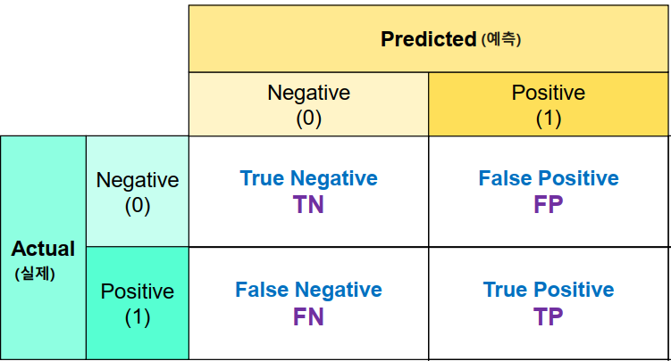
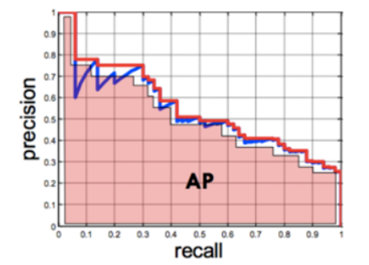

# 모델 평가
모델의 성능을 평가하고 그 결과에 따라 프로세스를 다시 반복

<br>

<p align="center"></p>

<br>

- 분류 : N개 중 하나를 맞추기
- 회귀 : 무한대 중 하나 
- 비지도 학습 : 정답 Label이 없음

<br>

이런 다양한 방법에 따라 평가지표가 달라야 함


<br>
<br>


## 분류와 회귀의 평가방법
### 분류 평가 지표
1. 정확도 (Accuracy)
1. 정밀도 (Precision)
1. 재현률 (Recall)
1. F1점수 (F1 Score)
1. PR Curve, AP
1. ROC, AUC
    - 2~6 최종적으로 이진분류 용

<br>

### 회귀 평가방법
1. MSE (Mean Squared Error)
1. RMSE (Root Mean Squared Error)
1. $R^2$ (결정계수)
    - 평균으로 예측하는 것보다 모델 성능이 얼마나 좋은지 
    - 1에 가까울 수록 좋은 값

<br>

### sckit-learn 평가함수 
- sklearn.metrics 모듈을 통해 제공

<br>
<br>

# 분류(Classification) 평가 기준
## 용어
- ### 이진 분류에서 양성과 음성
    - 양성(Positive): 예측하려는(찾으려는) 대상
        - 틀렸을 때 문제가 더 큰 대상
        - 이 모델의 Focus가 주로 양성을 분류하는 것에 초점!
    - 음성(Negative): 예측하려는 대상이 아닌 것
    - 예
        - 암환자 분류 : 양성 - 암 환자, 음성 - 정상인
        - 스팸메일 분류 : 양성 - 스팸메일, 음성 - 정상메일
        - 금융사기 모델: 양성 - 사기거래, 음성 - 정상거래
        
    <br>

## 정확도 (Accuracy)

$$
\large{
정확도 (Accuracy) = \cfrac{맞게 예측한 건수} {전체 예측 건수}
}
$$

- 전체 예측 한 것중 맞게 예측한 비율로 평가
- `accuracy_score(정답, 모델예측값)`

<br>

### Accuracy 평가지표의 문제
- 불균형 데이터의 경우 정확한 평가지표가 될 수 없음
    - 예: 양성과 음성의 비율이 1:9 인 경우 모두 음성이라고 하면 정확도는 90%가 됨

<br>

## 혼동 행렬(Confusion Marix)
- 분류의 평가지표의 기준
- 혼동행렬을 이용해 다양한 평가지표(정확도, 재현률, 정밀도, F1 점수, AUC 점수)를 계산
- 함수: confusion_matrix(정답, 모델예측값)
- 결과의 0번축: 실제 class, 1번 축: 예측 class

<br>

- 맞았는지 여부 | 예측한 값
- 일반적으로 0을 negative, 1을 positive라고 데이터 set을 구성해줌

<br>

<p align="center"></p>

<br>

>- TP(True Positive) - 양성으로 예측했는데 맞은 개수
>- TN(True Negative) - 음성으로 예측했는데 맞은 개수
>- FP(False Positive) - 양성으로 예측했는데 틀린 개수 (음성을 양성으로 예측)
>- FN(False Negative) - 음성으로 예측했는데 틀린 개수 (양성을 음성으로 예측)

<br>
<br>


## 이진 분류 평가점수
- ### Accuracy (정확도) 
    - 전체 데이터 중에 맞게 예측한 것의 비율

<br>

- ### Recall/Sensitivity(재현율/민감도) 
    - 실제 Positive(양성)인 것 중에 Positive(양성)로 예측 한 것의 비율
    - **TPR**(True Positive Rate) 이라고도 함
    
    <br>
    
    - 스팸 메일 중 스팸메일로 예측한 비율
    - 금융사기 데이터 중 사기로 예측한 비율

<br>

- ### Precision(정밀도) 
    - Positive(양성)으로 예측 한 것 중 실제 Positive(양성)인 비율
    - **PPV**(Positive Predictive Value) 라고도 함
    
    <br>
    
    - 스팸메일로 예측한 것 중 스팸메일의 비율
    - 금융 사기로 예측한 것 중 금융사기인 것의 비율

<br>

- ### F1 점수
    - 정밀도와 재현율의 조화평균 점수
    - recall과 precision이 비슷할 수록 높은 값을 가지게 됨
    = F1 score가 높다는 것은 recall과 precision이 한쪽으로 치우쳐저 있이 않고 둘다 좋다고 판단할 수 있는 근거
    
    - 산술평균은 0.3 0.3 이어도, 0.2 0.4 이어도 평균이 0.3
    - 하지만 조화평균은 값이 차이가 나면 평균값이 낮게 나옴!
   
<br>
    
### 기타
- ### Specificity(특이도)
    - 실제 Negative(음성)인 것들 중 Negative(음성)으로 맞게 예측 한 것의 비율
    - TNR(True Negative Rate) 라고도 함
    - Negative의 recall이라고 생각하면 됨 

<br>

- ### Fall out(위양성률)
    - 실제 Negative(음성)인 것들 중 Positive(양성)으로 잘못 예측한 것의 비율. `1 - 특이도`
    - **FPR** (False Positive Rate) 라고도 함
    - $ Fall-Out(FPF) = \cfrac{FP}{TN+FP}$


<br>
<br>

## 각 평가 지표 계산 함수
- sklearn.metrics 모듈

    - **confusion_matrix(y 실제값, y 예측값)**
        - 혼돈 행렬 반환
    - **recall_score(y 실제값, y 예측값)**
        - Recall(재현율) 점수 반환 (Positive 중 Positive로 예측한 비율 (TPR))
    - **precision_score(y 실제값, y 예측값)**
        - Precision(정밀도) 점수 반환 (Positive로 예측한 것 중 Positive인 것의 비율 (PPV))
    - **f1_score(y 실제값, y 예측값)**
        - F1 점수 반환 (recall과 precision의 조화 평균값)
    - **classification_report(y 실제값, y 예측값)**    
        - 클래스 별로 recall, precision, f1 점수와 accuracy를 종합해서 보여줌


    - **plot_confusion_matrix** 
        - 버전 2.1.3에서 추가됨
        - 존재하지 않는다고 에러나는 경우 업데이트 필요 <br>
            `pip install scikit-learn --upgrade`


- 코드
    ```python
    from sklearn.metrics import accuracy_score
    from sklearn.metrics import recall_score
    from sklearn.metrics import precision_score
    from sklearn.metrics import f1_score
    from sklearn.metrics import confusion_matrix
    from sklearn.metrics import classification_report
    from sklearn.metrics import plot_confusion_matrix
    import matplotlib.pyplot as plt

    # 미리 학습한 dummpy_model 이용

    # 정확도 구하기
    print(accuracy_score(y_train, pred_train))
    print(accuracy_score(y_test, pred_test))

    # 재현율 구하기 
    print(recall_score(y_train, pred_train))
    print(recall_score(y_test, pred_test))

    # 정밀도 구하기
    print(precision_score(y_train, pred_train))
    print(precision_score(y_test, pred_test))

    # f1 구하기
    print(f1_score(y_train, pred_train))
    print(f1_score(y_test, pred_test))

    # 혼돈행렬 구하기
    print(confusion_matrix(y_train, pred_train))
    print(confusion_matrix(y_test, pred_test))

    # classification_report 구하기
    print(classification_report(y_train, pred_train))
    print(classification_report(y_test, pred_test))

    # plot_confusion_matrix 그리기
    fig, ax = plt.subplots(1, 1,figsize=(5, 5))
    print(fig, ax)
    plot_confusion_matrix(dummy_model, # 학습한 모델
                        X_train, # 예측할 X, 모델
                        y_train, # 정답 y
                        display_labels= ['neg', 'pos'],
                        values_format='d',
                        cmap="Blues",
                        ax = ax
                        )

    fig, ax = plt.subplots(1, 1,figsize=(5, 5))
    plot_confusion_matrix(dummy_model, # 학습한 모델
                        X_test,
                        y_test,
                        display_labels=['neg', 'pos'],
                        values_format='d',
                        cmap="Blues",
                        ax = ax
                        )

    ```

<br>
<br>

## 재현율과 정밀도의 관계

#### 재현율이 더 중요한 경우
- 실제 Positive 데이터를 Negative 로 잘못 판단하면 업무상 큰 영향이 있는 경우
- FN(False Negative)를 낮추는데 촛점을 맞춤
- 암환자 판정 모델, 보험사기적발 모델

#### 정밀도가 더 중요한 경우
- 실제 Negative 데이터를 Positive 로 잘못 판단하면 업무상 큰 영향이 있는 경우.
- FP(False Positive)를 낮추는데 초점을 맞춤
- 스팸메일 판정

<br>

## 임계값(Threshold) 변경을 통한 재현율, 정밀도 변환
- 정밀도나 재현율을 특히 강조해야 하는 상황일 경우 임계값 변경을 통해 평가 수치를 올릴 수있음

- 극단적으로 임계점을 올리나가 낮춰서 한쪽의 점수를 높이면 안됨

<br>

### 임계값 변경에 따른  정밀도와 재현율 변화관계
- **임계값을 낮추면 재현율은 올라가고 정밀도는 낮아짐**
- **임계값을 높이면 재현율은 낮아지고 정밀도는 올라감**
    - 임계값을 변화시켰을때 **재현율과 정밀도는 음의 상관관계**
    - 임계값을 변화시켰을때 재현율과 위양성율(Fall-Out/FPR)은 양의 상관관계


<br>

- 코드

    ```python
    import numpy as np
    import pandas as pd
    from sklearn.datasets import load_digits
    from sklearn.model_selection import train_test_split
    import matplotlib.pyplot as plt
    from sklearn.metrics import precision_recall_curve
    from sklearn.tree import DecisionTreeClassifier

    # 데이터
    mnist = load_digits()
    X = mnist['data']
    y = mnist['target']
    y = np.where(y == 9, 1, 0)


    # 데이터 나누기
    X_train, X_test, y_train, y_test = train_test_split(X, y, stratify=y, random_state=0)
    print(X_train.shape, X_test.shape, y_train.shape, y_test.shape)


    # 모델 생성
    tree = DecisionTreeClassifier(max_depth=3, random_state=0)

    # 모델 학습
    tree.fit(X_train, y_train)

    # 검증
    proba_test = tree.predict_proba(X_test) # 어떤 확률인지 알고싶을 때 

    precisions, recalls, thresholds = precision_recall_curve(y_test, proba_test[:,1])


    # dataframe으로 만들기
    thresholds = np.append(thresholds, 1)
    df = pd.DataFrame({'Threshold' : thresholds, 'Recall' : recalls,'Precisions' : precisions})

    # precision_recall_curve의 결과를 선 그래프로 확인
    plt.figure(figsize=(7, 7))
    plt.plot(thresholds, precisions, marker = 'o', label = "Precision")
    plt.plot(thresholds, recalls,marker = "o", label = "Recall")
    plt.legend(loc = "upper left", bbox_to_anchor=(1, 1))
    plt.grid(True)
    plt.show()
    ```

<br>

- 코드2 (Binarizer 이용)
    ```python
    # Bonarizer : 숫자가 들어오면 0, 1 두개의 Binary로 변환해주는 Transformer
    from sklearn.preprocessing import Binarizer
    import numpy as np
    import pandas as pd
    from sklearn.datasets import load_digits
    from sklearn.model_selection import train_test_split
    import matplotlib.pyplot as plt
    from sklearn.metrics import precision_recall_curve
    from sklearn.tree import DecisionTreeClassifier

    # 데이터
    mnist = load_digits()
    X = mnist['data']
    y = mnist['target']
    y = np.where(y == 9, 1, 0)


    # 데이터 나누기
    X_train, X_test, y_train, y_test = train_test_split(X, y, stratify=y, random_state=0)
    print(X_train.shape, X_test.shape, y_train.shape, y_test.shape)


    # 모델 생성
    tree = DecisionTreeClassifier(max_depth=3, random_state=0)

    # 모델 학습
    tree.fit(X_train, y_train)

    # 검증
    proba_test = tree.predict_proba(X_test) # 어떤 확률인지 알고싶을 때 


    # threshold 변화에 recall, precision 값 변화 

    binarizer1 = Binarizer(threshold=0.5)
    binarizer2 = Binarizer(threshold=0.1)
    binarizer3 = Binarizer(threshold=0.7)

    pred_test_0_5 = binarizer1.fit_transform(proba_test)[:, 1]
    pred_test_0_1 = binarizer2.fit_transform(proba_test)[:, 1]
    pred_test_0_7 = binarizer3.fit_transform(proba_test)[:, 1]

    print("Treshhold = 0.5")
    print(recall_score(y_test, pred_test_0_5) , precision_score(y_test, pred_test_0_5))
    print("Treshhold = 0.1") # recall 올라감,precision 내려감 => 실제 positive를 더 많이 맞췄다
    print(recall_score(y_test, pred_test_0_1) , precision_score(y_test, pred_test_0_1))
    print("Treshhold = 0.7")# recall 내려감, precision 올라감 => Positive 예측한 것이 더 많이 맞았다
    print(recall_score(y_test, pred_test_0_7) , precision_score(y_test, pred_test_0_7))

    ```


<br>
<br>


## PR Curve(Precision Recall Curve-정밀도 재현율 곡선)
- 0~1사이의 모든 임계값에 대하여 재현율(recall)과 정밀도(precision)의 변화를 이용한 평가 지표
- recall 관점에서 성능 지표를 확인, 즉 recall이 중요할 때 확인
- X축에 재현율, Y축에 정밀도를 놓고 임계값이 0 → 1 변화할때 두 값의 변화를 그린 선 그래프
    - X축 :   1 -> 0 
- recall 값이 커지더라고 precision값이 천천히 떨어지는 것이 중요
    - recall을 올리더라도 precision이 많이 떨어지지 않는 모델이 좋은 모델

<br>    

- **threshold를 변경해서 recall 점수를 올렸을 때 precision이 언제/얼마나 떨어지는지를 지표화 한 것** 

<br>

- sklearn.metrics 모듈
    - precision_recall_curve() : threshold별 recall/precision 점수 반환 함수 
    - plot_precision_recall_curve() : PR curve를 그려주는 함수 

<br>
<br>

## AP Score(Average Precision Score)
- AP Score
    - PR Curve의 성능평가 지표를 하나의 점수(숫자)로 평가한것.
    - PR Curve의 선아래 면적을 계산한 값으로 높을 수록 성능이 우수하다.
    - Object Detection 쪽에서 평가 지표로 많이 사용
    
    <br>

    <p align = "center"></p>
    
    <br>

- sklearn.metrics 모듈
    - average_precision_score() : AP score 게산 함수 

<br>

- 코드
    ```python
    import pandas as pd
    import matplotlib.pyplot as plt
    from sklearn.metrics import precision_recall_curve, plot_precision_recall_curve, average_precision_score
    from sklearn.tree import DecisionTreeClassifier
    from sklearn.ensemble import RandomForestClassifier

    # 모델 생성
    tree = DecisionTreeClassifier(random_state=0, max_depth = 3)
    rf = RandomForestClassifier(random_state=0, max_depth = 2, n_estimators=200) # tree 200개 만듦 그리고 학습 한 뒤 예측

    # 학습
    tree.fit(X_train, y_train)
    rf.fit(X_train, y_train)

    # 추론(확률)
    proba_test_tree = tree.predict_proba(X_test)[:, 1] # 양성인 확률
    proba_test_rf = rf.predict_log_proba(X_test)[:, 1]

    precision1, recall1, threshold1 = precision_recall_curve(y_test, proba_test_tree)
    precision2, recall2, threshold2 = precision_recall_curve(y_test, proba_test_rf)


    # plot_precision_recall_curve() 이용해서 그래프 그리기
    fig, ax = plt.subplots(1, 2, figsize=(15, 7))

    plot_precision_recall_curve(tree, # 모델
                                X_test,
                                y_test,
                                ax = ax[0]
                                )
    ax[0].set_title("Tree PR Curve")
    ax[0].grid(True)

    plot_precision_recall_curve(rf, X_test, y_test, ax=ax[1])
    ax[1].set_title("Random Forest PR Curve")
    ax[0].grid(True)

    plt.show()

    # AP Score 조회
    print("Decision Tree AP Score : ", average_precision_score(y_test, proba_test_tree))
    print("RandomForest AP Score : ", average_precision_score(y_test, proba_test_rf))
    ```
<br>
<br>

## ROC curve(Receiver Operating Characteristic Curve)와 AUC(Area Under the Curve) score

- **FPR(False Positive Rate-위양성율)**
    - 위양성율 (fall-out)
    - 1-특이도(TNR)
    - 실제 음성중 양성으로 잘못 예측 한 비율
    $$
    \cfrac{FP}{TN+FP}
    $$

    <br>

- **TPR(True Positive Rate-재현율/민감도)** 
    - 재현율(recall)
    - 실제 양성중 양성으로 맞게 예측한 비율
    
    $$
    \frac{TP}{FN+TP}
    $$

    <br>

- **ROC 곡선**
    - 2진 분류의 모델 성능 평가 지표 중 하나
    - 불균형 데이터셋을 평가할 때 사용
    - FPR을 X축, TPR을 Y축으로 놓고 임계값을 변경해서 FPR이 변할 때 TPR이 어떻게 변하는지 나타내는 곡선
    - FPR이 조금 오를 때 TPR이 많인 오르는 경우가 좋은 경우

<br>

- **AUC**
    - ROC 곡선 아래쪽 면적
    - 0 ~ 1 사이 실수로 나오며 클수록 좋음
   
   <br>
   
   - **AUC 점수기준**
        - 1.0 ~ 0.9 : 아주 좋음
        - 0.9 ~ 0.8 : 좋음
        - 0.8 ~ 0.7 : 괜찮은 모델
        - 0.7 ~ 0.6 : 의미는 있으나 좋은 모델은 아님
        - 0.6 ~ 0.5 : 좋지 않은 모델

    <br>

    <p align = "center"></p>
    
    <br>

    ### sklearn.metrics 모듈 - ROC, AUC 점수  확인
    - roc_curve(y값, 예측확률) : FPR, TPR, Thresholds (임계치)
    - roc_auc_score(y값, 예측확률) : AUC 점수 반환

    <br>
    <br>


## ROC Curve - PR Curve
- ROC: 이진분류에서 양성클래스 탐지와 음성클래스 탐지의 중요도가 비슷할 때 사용
    - 개고양이 분류

- PR curve(Precision Recall 커브): 양성 클래스 탐지가 음성클래스 탐지의 중요도보다 높을 경우 사용
    - 암환자 진단


<br>

- 코드
    ```python
    from sklearn.metrics import roc_curve, plot_roc_curve, roc_auc_score

    # roc_curve 값 구하기
    fprs1, tprs1, threshold1 = roc_curve(y_test, proba_test_tree)
    fprs2, tprs2, threshold2 = roc_curve(y_test, proba_test_rf)

    # DataFrame 만들기
    pd.DataFrame({"TH" : threshold1, "FPR" : fprs1, "TPR" : tprs1})

    #ROC curve 직접 작성
    plt.figure(figsize=(8,6))
    plt.plot(fprs1, tprs1, marker='o',label = "Tree Model") # X : FPR, Y : TPR
    plt.plot(fprs2, tprs2, marker='x',label = "RF Model") # X : FPR, Y : TPR
    plt.legend(loc = "lower right")
    plt.grid(True)
    plt.show()

    # roc_auc_score
    print("Decision Tree roc auc score : ", roc_auc_score(y_test, proba_test_tree))
    print("RandomForest roc auc score : ", roc_auc_score(y_test, proba_test_rf))

    # plot_roc_curve
    _, ax = plt.subplots(1, 1, figsize=(8, 6))
    plot_roc_curve(tree, X_test, y_test, ax =ax)
    plot_roc_curve(rf, X_test, y_test, ax =ax)
    plt.grid(True)
    plt.show()

    ```
