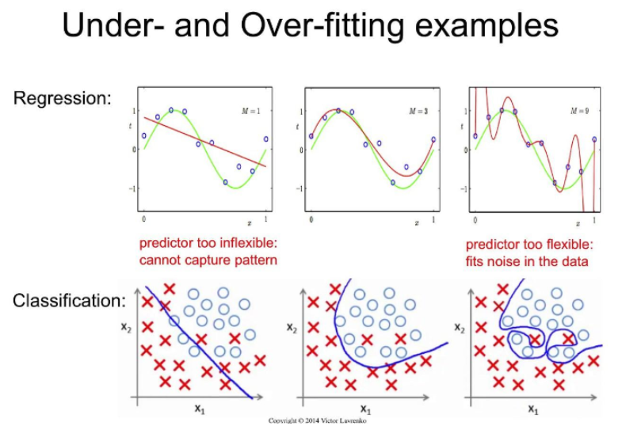

# 과대적합(Overfitting )

- ### 일반화 (Generalization) 
    - 모델이 새로운 데이터셋(테스트 데이터)에 대하여 정확히 예측하면 이것을 (훈련데이터에서 테스트데이터로) 일반화었다고 함
    - 모델이 훈련 데이터로 평가한 결과와 테스트 데이터로 평가한 결과의 차이가 거의 없고 좋은 평가지표를 보여줌
    - 좋은 평가지표는 설정한 목표에 얼마나 잘 도달하는가를 의미

<br>

- ### 과대적합 (Overfitting)
    - 모델이 훈련 데이터에 대한 예측성능은 **너무** 좋지만 일반성이 떨어져 새로운 데이터(테스트 데이터)에 대해선 성능이 좋지 않은 것
    - 이는 모델이 훈련 데이터 세트의 특징을 너무 맞춰서 학습 되었기 때문에 일반화 되지 않아 새로운 데이터셋(테스트세트)에 대한 예측 성능이 떨져 발생

    <br>

- ### 과소적합 (Underfitting)
    - 모델이 훈련 데이터과 테스트 데이터셋 모두에서 성능이 좋지 않은 것
    - 훈련 데이터에 대해 충분히 학습하지 못해 데이터셋의 패턴들을 다 찾아내지 못해서 발생

    <br>

    <p align=center></p>
        
        - Regression
            - green : 실제 모델이 찾아야 하는 목표
            - red : 예측한 값

    <br>
    <br>

## Overfitting(과대적합)의 원인
- 학습 데이터 양에 비해 모델이 너무 복잡한 경우
    - 모델을 단순하게 바꿈 
        - 데이터의 양을 늘림 
            - 시간과 돈이 들기 때문에 현실적으로 어렵움
        
        <br>
        
    - 각 모델은 규제와 관련된 **하이퍼파라미터 조절**

<br>
<br>

## Underfitting(과소적합)의 원인
- 학습 데이터 양에 비해서 모델이 너무 단순한 경우 발생
    - 복잡한 모델을 사용
        - 복잡한 모델의 가장 대표적인 예는 딥러닝

<br>
<br>

## 최적의 하이퍼파라미터 찾기
1. 만족할 만한 하이퍼파라미터들의 값의 조합을 찾을 때 까지 일일이 수동으로 조정
2. GridSearch 사용
    - GridSearchCV()
        - 시도해볼 하이퍼파라미터들을 지정하면 모든 조합에 대해 교차검증 후 제일 좋은 성능을 내는 하이퍼파라미터 조합 찾음
        - 적은 수의 조합의 경우는 괜찮지만 시도할 하이퍼파라미터와 값들이 많아지면 너무 많은 시간 소요

3. Random Search 사용    
    - RandomizedSearchCV()
        - GridSeach와 동일한 방식으로 사용
        - 모든 조합을 다 시도하지 않고 각 반복마다 임의의 값만 대입해 지정한 조합의 수만큼만 평가한 후 그 조합 중 최적의 파라미터 찾음
        


- **할 수 있으면 GRidSearch를 하는 것이 좋음**

<br>

### [GridSearchCV](https://scikit-learn.org/stable/modules/generated/sklearn.model_selection.GridSearchCV.html) 
- 주요 매개변수
    - estimator: 모델객체 지정
    - params : 하이퍼파라미터 목록을 dictionary로 전달 '파라미터명':[파라미터값 list] 형식
    - scoring: 평가 지표
        - 평가지표문자열: https://scikit-learn.org/stable/modules/model_evaluation.html
        - 여러개일 경우 List로 묶어서 지정
    - cv : 교차검증시 fold 개수. 
    - n_jobs : 사용할 CPU 코어 개수 (None:1(기본값), -1: 모든 코어 다 사용)

<br>

- 메소드
    - fit(X, y) : 학습
    - predict(X): 제일 좋은 성능을 낸 모델로 predict()
    - predict_proba(X): 제일 좋은 성능을 낸 모델로 predict_proba() 호출

<br>

- 결과 조회 속성
    - cv_results_ : 파라미터 조합별 결과 조회
    - best_params_ : 가장 좋은 성능을 낸 parameter 조합 조회
    - best_estimator_ : 가장 좋은 성능을 낸 모델 반환
    - best_score_: 가장 좋은 점수 반환   

<br>

- 코드
    ```python
    from sklearn.datasets import load_breast_cancer
    from sklearn.model_selection import train_test_split
    from sklearn.model_selection import GridSearchCV
    from sklearn.tree import DecisionTreeClassifier
    from sklearn.metrics import accuracy_score


    # 데이터 받아오기
    data = load_breast_cancer()
    X = data['data']
    y = data['target']

    # 데이터 나누기
    X_train, X_test, y_train, y_test = train_test_split(X, y, stratify=y, random_state=0)

    # 모델
    tree = DecisionTreeClassifier(random_state=0)

    # 하이퍼파라미터후보 - dictionary 형태
    param = {
        "max_depth" : [None, 1, 2, 3, 4, 5],
        "max_leaf_nodes" : [3, 5, 7, 9]
    } # 나머지는 default 값 사용

    # 어떻게 Grid Search를 진행할지 정하는 객체 생성
    gs = GridSearchCV(tree,# GridSearch를 적용할 모델
                    param, # 하이퍼파라미터 후보딕셔너리
                    scoring = ["accuracy", "recall"], # 평가지표
                    refit = "accuracy", # 여러 개의 평가지표 지정할 경우 최종 rank를 선택할 때 사용할 평가 지표 지정(이 지표가 1인 파라미터로 모델을 재 학습시킨다.)
                    cv = 3, # crossvalidation 시 몇개의 fold로 나눌지, 보통은 4, 5많이 사용
                    n_jobs= -1 # 이컴퓨터에 있는 모든 CPU 사용
                    ) # 조합개수 : 6 X 4 X 3
                    
    # search 실행
    gs.fit(X_train, y_train)

    # 모든 경우 별 결과 확인
    gs.cv_results_ # 딕셔너리
    result_df = pd.DataFrame(gs.cv_results_)
    # result_df[result_df.columns[6:]].sort_values('rank_test_score')
    result_df[result_df.columns[6:]].sort_values('rank_test_accuracy')

    # 가장 좋은 평가 점수
    print("best_score_ :  : ", gs.best_score_)

    # best 모델 조회
    print("best_estimator_ : ", gs.best_estimator_)

    # best 파라미터 조합
    print("best_params_ : ", gs.best_params_)

    # 정확도 - 
    print(accuracy_score(y_test, gs.best_estimator_.predict(X_test)))
    print(accuracy_score(y_test, gs.predict(X_test))) # gs.predict 하면 best_model의 값으로 계산해줌

    ```

<br>

### [RandomizedSearchCV](https://scikit-learn.org/stable/modules/generated/sklearn.model_selection.RandomizedSearchCV.html)
- 주요 매개변수
    - estimator: 모델객체 지정
    - param_distributions : 하이퍼파라미터 목록을 dictionary로 전달 '파라미터명':[파라미터값 list] 형식
    - n_iter : 파라미터 검색 횟수
    - scoring: 평가 지표
    - cv : 교차검증시 fold 개수. 
    - n_jobs : 사용할 CPU 코어 개수 (None:1(기본값), -1: 모든 코어 다 사용)

<br>

- 메소드
    - fit(X, y) : 학습
    - predict(X): 제일 좋은 성능을 낸 모델로 predict()
    - predict_proba(X): 제일 좋은 성능을 낸 모델로 predict_proba() 호출

<br>

- 결과 조회수 속성(Attribute)
    - cv_results_ : 파라미터 조합별 결과 조회
    - best_params_ : 가장 좋은 성능을 낸 parameter 조합 조회
    - best_estimator_ : 가장 좋은 성능을 낸 모델 반환
    - best_score_ : 가장 좋은 점수

<br>

- 코드
    ```python
    import numpy as np
    import pandas as pd
    from sklearn.datasets import load_iris
    from sklearn.model_selection import train_test_split
    from sklearn.model_selection import RandomizedSearchCV
    from sklearn.tree import DecisionTreeClassifier

    # 데이터 받아오기
    X, y = load_iris(return_X_y = True)

    # 데이터 나누기
    X_train, X_test, y_train, y_test = train_test_split(X, y, stratify=y, random_state=0)

    # 모델
    tree = DecisionTreeClassifier(random_state=0)

    # 파라미터 지정
    param = {
        "max_depth" : range(1, 11),
        "max_leaf_nodes" : range(3, 31, 3),
        "criterion" : ["gini", "entropy"] # 순도 계산 방법
    }

    # 객체 생성
    rs = RandomizedSearchCV(tree,
                        param,
                        n_iter=50, # 총 200개의 조합중에서 50개를 random하기 선택하여 test
                        cv = 5, 
                        n_jobs= -1
                        )

    # search 실행
    rs.fit(X_train, y_train)

    # 전체 결과확인
    result_df = pd.DataFrame(rs.cv_results_)
    result_df[result_df.columns[6:]].sort_values('rank_test_score')

    # 가장 좋은 평가 점수
    print("best_score_ :  : ", rs.best_score_)

    # best 모델 조회
    print("best_estimator_ : ", rs.best_estimator_)

    # best 파라미터 조합
    print("best_params_ : ",rs.best_params_)

    # 정확도 - 
    print(accuracy_score(y_test, rs.best_estimator_.predict(X_test)))
    print(accuracy_score(y_test, rs.predict(X_test))) # gs.predict 하면 best_model의 값으로 계산해줌

    ```
<br>

**RandomSearch를 진행 한 후, 가장 좋은 결과가 나오는 근처에서 GridSearch를 수행**