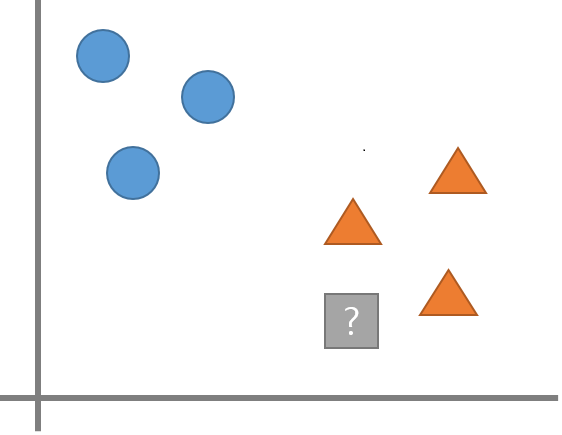
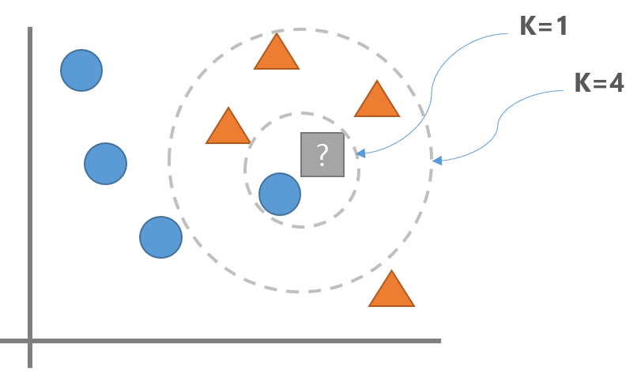
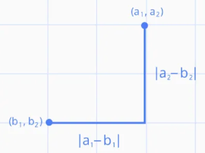

# K-최근접 이웃 (K-Nearest Neighbors, K-NN)
- 분류(Classification)와 회귀(Regression) 를 모두 지원

- White box model이라고 볼 수 있음

- 예측하려는 데이터와 input 데이터들 간의 거리를 측정해 가장 가까운 K개의 데이터셋의 레이블을 참조해 분류/예측

- 학습시 단순히 input 데이터들을 저장만 하며 예측 시점에 거리를 계산
    - **학습은 빠르지만 예측시 시간이 많이 소요됨**
        - 데이터만 가지고 있기 때문에 fit, 즉 학습할 때는 시간이 적게 걸림
        - 학습 데이터를 가지고 있다가 predict를 하게 되면 자기가 가지고 있는 학습 데이터의 거리를 재는 것
        - 예측, 즉 서비스 할 때의 시간이 오래 걸림


<br>
<br>

## 분류

<br>

<p align=center></p>

<br>

- K-NN에서 **K**는 새로운 데이터포인트를 분류할때 확인할 데이터 포인트의 개수를 지정하는 **하이퍼파라미터**

<br>


<p align=center></p>

<br>

- K를 1로 하면(즉 가장 가까운 하나의 이웃만 고려하면) <font color='blue'>파란색</font>으로 분류
- K를 3으로 하면 <font color='blue'>주황색</font> 으로 분류

<br>

- K가 너무 작으면 과적합(Overfitting)이 일어나고 K가 너무 크면 성능이 나빠짐(Underfitting). 
    - Overfitting : K값을 더 크게 잡아줌
    - Underfitting : K값을 더 작게 잡아줌 

    <br>

- K 값은 우리가 지정해줌, 즉 hyper-parameter

<br>
<br>

## 주요 하이퍼 파라미터
- 이웃 수 
    - n_neighbors = K
    - **K가 작을 수록 모델이 복잡해져 과적합이 일어나고 너무 크면 단순해져 성능이 나빠짐**
    - n_neighbors는 Feature수의 제곱근 정도를 지정할 때 성능이 좋은 것으로 알려져 있음
    
    <br>

- 거리 측정 방법 
    - p=2: 유클리디안 거리(Euclidean distance - 기본값)
    - p=1: 맨하탄 거리(Manhattan distance)

<br>

> ### 유클리디안 거리(Euclidean_distance, L2 norm)

<br>

<p align=center></p>

<br>

<!-- $$
distance = \sqrt{(a_1 - b_1)^2 + (a_2-b_2)^2}\\
n차원 벡터간의 거리 = \sqrt{(a_1 - b_1)^2 + (a_2-b_2)^2 +...+(a_n-b_n)^2}
$$ -->

> ### 맨하탄 거리 (Manhattan distance, L1 norm)

<br>

<p align=center></p>


<br>

<!-- $$
distance = |a_1 - b_1| + |a_2 - b_2| \\
𝑛차원벡터간의거리= |a_1 - b_1| + |a_2 - b_2| + ... + |a_n - b_n|
$$ -->

<br>
<br>


## 요약
- K-NN은 이해하기 쉬운 모델이며 튜닝할 하이퍼파라미터의 수가 적어 빠르게 만들 수 있음
- K-NN은 서비스할 모델을 구현할때 보다는 **복잡한 알고리즘을 적용해 보기 전에 확인용 또는 base line을 잡기 위한 모델로 사용**
- 훈련세트가 너무 큰 경우(Feature나 관측치의 개수가 많은 경우) 거리를 계산하는 양이 늘어나 예측이 느려짐
- Feature간의 값의 단위가 다르면 작은 단위의 Feature에 영향을 많이 받게 되므로 **전처리로 Scaling작업**이 필요!!
- Feature가 너무 많은 경우와 대부분의 값이 0으로 구성된(희소-sparse) 데이터셋에서 성능이 아주 나쁨!!
    - 범주형 데이터를 다룰 때 **Label Encoding**을 해야함!

<br>

- 코드

    ```python
    from sklearn.datasets import load_breast_cancer
    from sklearn.model_selection import train_test_split
    from sklearn.model_selection import GridSearchCV
    from sklearn.neighbors import KNeighborsClassifier
    from sklearn.preprocessing import LabelEncoder
    from sklearn.preprocessing import MinMaxScaler
    from sklearn.metrics import accuracy_score
    from sklearn.pipeline import Pipeline

    # 데이터 로드 및 분류
    X, y = load_breast_cancer(return_X_y = True)
    X_train, X_test, y_train, y_test = train_test_split(X, y, stratify=y, random_state=0)

    # 파이프라인 생성
    order = [
        ('scaler', MinMaxScaler()),
        ('knn', KNeighborsClassifier())
    ]

    pipeline = Pipeline(order, verbose=True)

    # GridSearch
    param = {
        "knn__n_neighbors" : range(1, 11),
        "knn__p" : [1, 2]
    }

    gs = GridSearchCV(pipeline, param, scoring="accuracy", cv = 5, n_jobs=-1)
    gs.fit(X_train, y_train)

    result_df = pd.DataFrame(gs.cv_results_)
    result_df[result_df.columns[6:]].sort_values('rank_test_score')

    best_model = gs.best_estimator_
    print(accuracy_score(y_test, best_model.predict(X_test)))
    ```
