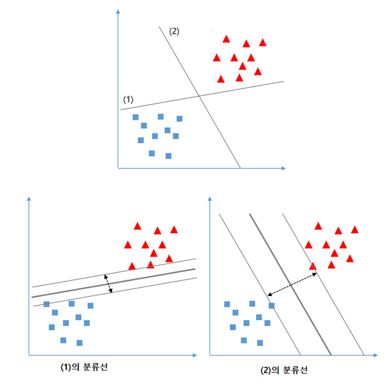
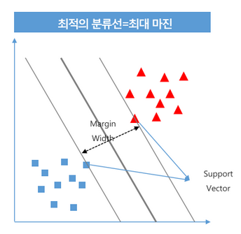
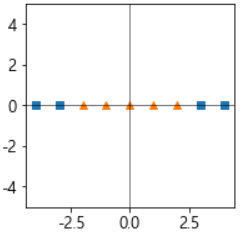
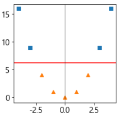
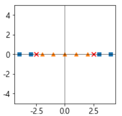
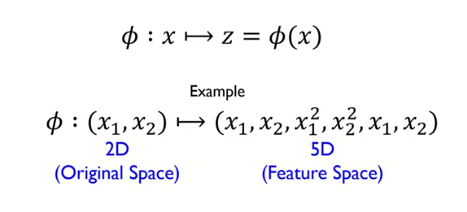
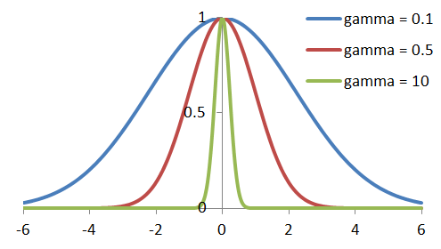
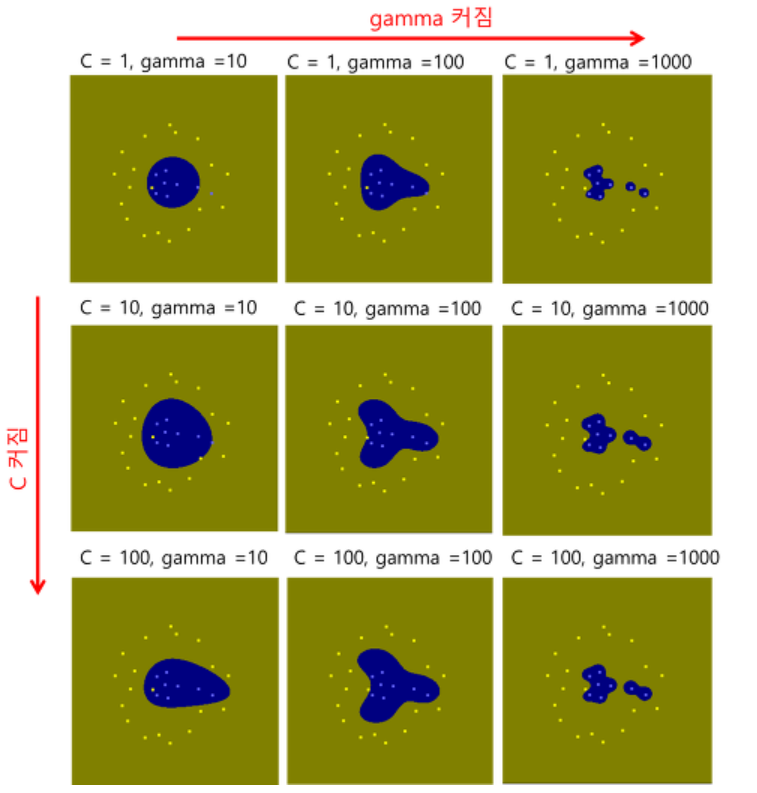
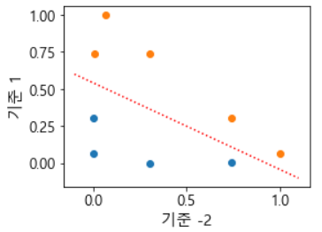

# Support Vector Machine (SVM)

## 선형(Linear) SVM 

- 딥러닝 이전에 분류에서 뛰어난 성능으로 많이 사용되었던 분류 모델
- 하나의 분류 그룹을 다른 그룹과 분리하는 최적의 경계를 찾아내는 알고리즘
- **중간크기의 데이터셋**과 **특성(Feature)이 많은** 복잡한 데이터셋에서 좋은 성능을 보이는 것으로 알려짐

<br>

<p align=center></p>

<br>
<br>

## 목표: support vector간의 가장 넓은 margin을 가지는 초평면(결정경계) 찾기

### 초평면
- 데이터가 존재하는 공간보다 1차원 낮은 부분공간
    - n차원의 초평면은 n-1차원
    - 공간을 나누기 위해 초평면을 사용

<br>

### 차원
- 차원 : feature의 개수라고 생각해도 됨
- Support Vector
    - 경계를 찾아내는데 기준이 되는 데이터포인트
    - 초평면에 가장 가까이 있는 vector(데이터포인트) 의미
    - 가장 가까운 점이 하나가 아닐 수도 있기 때문에 vector

<br>

- margin : 두 support vector간의 너비
- margin이 넓은 결정경계를 만드는 함수를 찾는 것.

<br>

<p align=center></p>

<br>
<br>


## Hard Margin, Soft Margin
- Soft margin
    - Overfitting(과적합)을 방지하기 위해 어느정도 오차를 허용하는 방식
- Hard Margin
    - 오차를 허용하지 않는 방식을 Hard Margin
    - 완변하게 분리할 수 있는 결정경계를 찾아주는 것
    - 하나의 데이터(이상치) 때문에 결정 경계가 확 쏠리는 경우가 생길 수 있음
<br>

- 노이즈가 있는 데이터나 선형적으로 분리 되지 않는 경우 **하이퍼파마미터인 C** 조정해 마진을 변경

<br>

- C
    - 얼마나 많은 데이터 샘플이 다른 클래스에 놓이는 것을 허용하는지 결정하는 하이퍼파라미터 (기본값 :  1)

    - 파라미터값을 크게주면 적게 허용
        - 마진폭이 좁아져 마진 오류가 작아짐, 즉, hard margin에 가까워짐
        - Overfitting이 일어날 가능성이 큼
  
    - 파라미터값을 작게 주면 많이 허용
        - 마진폭이 넓어져 마진 오류가 커짐 
        - 훈련데이터에서는 성능이 안좋아지나 일반화(generalization)되어 테스트 데이터의 성능이 올라감
        - underfitting 이 날 가능성 존재
     
     <br>   
    
    - size는 log scale로 변화[0.01, 0.1, 1, 10, ,,] 이런 식으로 

<br>

**SVM 도 scaleing 하는 것이 성능이 좋음**

- 코드
    ```python
    from sklearn.datasets import load_breast_cancer
    from sklearn.model_selection import train_test_split, GridSearchCV
    from sklearn.preprocessing import StandardScaler
    from sklearn.svm import SVC
    from sklearn.metrics import accuracy_score
    from sklearn.pipeline import Pipeline

    # 데이터 로드 및 분리
    X, y = load_breast_cancer(return_X_y = True)
    X_train, X_test, y_train, y_test = train_test_split(X, y, stratify=y, random_state=0)

    # pipeline 생성
    order = [
        ('standardscaler', StandardScaler()),
        ('svc', SVC())
    ]
    pipeline = Pipeline(order, verbose=True)

    # search
    param = {
        "svc__C" : [0.0001, 0.001, 0.01, 0.1, 1, 10, 100] 
    }

    gs = GridSearchCV(pipeline, param, scoring = "accuracy", cv = 5, n_jobs=-1)

    gs.fit(X_train, y_train)
    best_model = gs.best_estimator_
    print(accuracy_score(y_test, best_model.predict(X_test)))
    ```

<br>
<br>

## 커널 서포트 벡터 머신
### 비선형데이터 셋에 SVM 적용
- 선형으로 분리가 안되는 경우 존재

    <br>

    <p align=center></p>

<br>

- 다항식 특성을 추가하여 차원을 늘려 선형 분리가 되도록 변환 

    <center>[2차원으로 변환 $x_3=x_1^2$ 항 추가]</center>

    <p align=center></p>

    <br>

    <center>[원래 공간으로 변환]</center>
    
    <p align=center></p>

    <br>

### 차원을 늘리는 경우의 문제
- 다항식 특성을 추가하는 방법은 낮은 차수의 다항식은 데이터의 패턴을 잘 표현하지 못해 과소적합이 너무 높은 차수의 다항식은 과대적합과 모델을 느리게 하는 문제가 있다.

<br>


### [커널 트릭(Kernel trick)](https://www.youtube.com/watch?v=ltjhyLkHMls)
- 다항식을 만들기 위한 특성을 추가하지 않으면서 수학적 기교를 적용해 다항식 특성을 추가한 것과 같은 결과를 얻는 방식

<br>

<p align=center></p>

<br>

- SVM을 original space가 아닌 feature space에서 학습
- Original Space: nonlinear decision boundary -> Feature space: linear decision boundary

<br>

- 커널 함수의 종류
    - Polynomial kernel
    - Sigmoid Kernel (Hyperbolic tangent kernel)
    - RBF kernel (Gaussian kernel)

<br>

#### 방사기저(radial base function-RBF) 함수
- 커널 서포트 벡터 머신의 기본 커널 함수
- 기준점들이 되는 위치를 지정하고 각 샘플이 그 기준점들과 얼마나 떨어졌는 지를 계산 => 유사도(거리)
- 기준점 별 유사도 계산한 값은 원래 값보다 차원이 커지고 선형적으로 구분될 가능성이 커짐


<br>

- 하이퍼파라미터 **gamma**
    - 하나의 데이터 샘플이 영향력을 행사하는 거리를 결정
    - 가우시안 함수의 표준편차와 관련되어 있는데, 클수록 작은 표준편차를 가짐
    - 즉, gamma가 클수록 한 데이터 포인트들이 영향력을 행사하는 거리가 짧아짐
    - gamma가 낮으면 데이터 포인트들이 영향력을행사하는 거리가 길어짐

<br>

-  $\gamma$이 커지면 결과 작아짐
-  $\gamma$이 작아지면 결과 커짐

- 결과가 커질수록 최종 결과가 직선형태가 됨

    <br>
        
    <p align=center>
    </p>

    
    <center> <a href = https://bskyvision.com/163>그림출처</a> <center>
    
    

    <br>

    <p align=center></p>
    <center> <a href = https://bskyvision.com/163>그림출처</a> <center>


    <br>

    <!-- $$
    \Phi(x, l) = exp\left(-\gamma \left\|x-l\right\|^2\right)
    $$
    <center>방사기저함수($\Phi$) x: 샘플, l: 기준값, $\gamma$: 규제 파라미터<center> -->

    <br>

    <p align=center></p>

    <center> $gamma=0.3, 기준점:-2,1$</center>

    <br>

    >-  위의 1차원 데이터가 실제로는 이렇게 2차원으로 바뀌게 됨
    >- 기준점(landmark)를 하나를 잡으면 1차원, 2개를 잡으면 2차원이 됨!

    >-  기준점을 몇개를잡느냐에 따라서 늘릴 수 있는 공간의 차원이 달라짐!

    >- 원래 1차원 데이터 5이면 값이 하나...
    >- 기준점과의 거리를 계산하여 3과 6이 나모

    >- x  <br>
    > -5 0

    > -5 ===>
    > a와의 거리 b와의 거리 <br>
    > 3             6         0


<br>

### rbf(radial basis function) 하이퍼파라미터
- C
    - 오차 허용기준. 작은 값일 수록 많이 허용
        - 큰값일 수록 과적합이 날 가능성이 높아짐
    - 과적합일 경우 값을 감소 
    - 과소적합일 경우 값을 증가

<br>

- gamma 
    - 방사기저함수의 $\gamma$로 규제의 역할
        - 큰값일 수록 과적합이 날 가능성이 높아짐
    - 모델이 과대적합일 경우 값을 감소 
    - 과소적합일 경우 값을 증가

<br>

- 코드
    ```python
    import numpy as np
    import pandas as pd
    from sklearn.datasets import load_breast_cancer
    from sklearn.model_selection import train_test_split,GridSearchCV
    from sklearn.preprocessing import StandardScaler
    from sklearn.svm import SVC
    from sklearn.metrics import accuracy_score
    from sklearn.metrics import roc_auc_score, average_precision_score

    X, y = load_breast_cancer(return_X_y = True)
    X_train, X_test, y_train, y_test = train_test_split(X, y, stratify=y, random_state=0)

    # SVM 선형기반 -> 전처리
    scaler = StandardScaler()
    X_train_scaled = scaler.fit_transform(X_train)
    X_test_scaled = scaler.fit_transform(X_test)

    # 최적의 파라미터 찾기
    gamma_param =  [0.0001, 0.001,0.01,1, 10, 100]

    train_acc_list = []
    test_acc_list = []

    for gamma in gamma_param:
        svc = SVC(random_state=0, C = 1, gamma=gamma, kernel = 'rbf')
        svc.fit(X_train_scaled, y_train)
        
        pred_train = svc.predict(X_train_scaled)
        pred_test = svc.predict(X_test_scaled)
        
        train_acc_list.append(accuracy_score(y_train, pred_train))
        test_acc_list.append(accuracy_score(y_test, pred_test))
        

    df = pd.DataFrame({
        'Gamma' : gamma_param,
        'Treain_Acc' : train_acc_list,
        'Test_Acc' : test_acc_list
    })

    svc = SVC(random_state = 0, C =1, gamma=0.01, kernel='rbf', probability=True)
    svc.fit(X_train_scaled, y_train)

    prob_test = svc.predict_proba(X_test_scaled)
    # svc는 predict_proba를 기본적으로 사용 못함
    # probability=False 이기 때문에 probability=True로 바꾸어야 함!

    print(roc_auc_score(y_test, prob_test[:, 1]), average_precision_score(y_test, prob_test[:,1]))
    ```