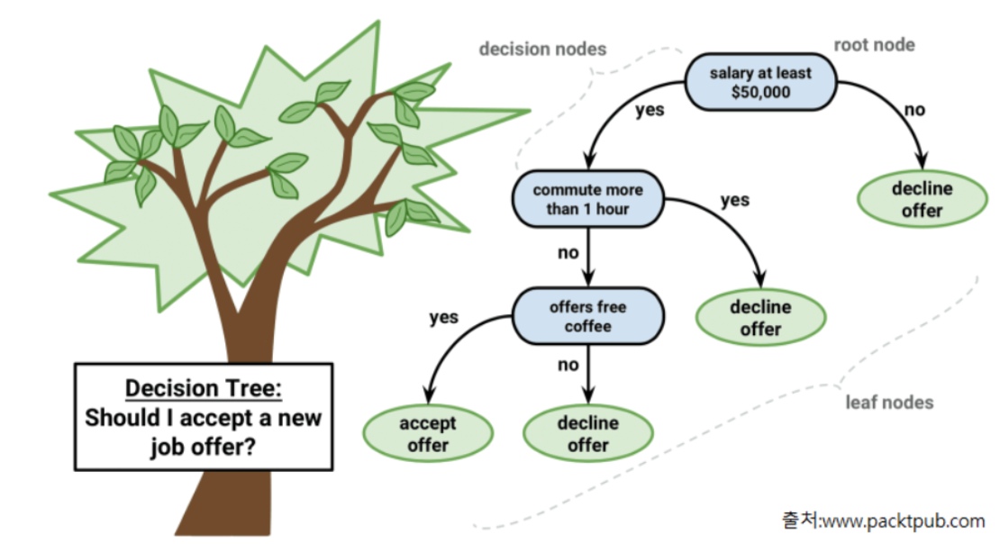

# 의사결정나무(Decision Tree )

<p align=center> </p>

<br>

## 개요

- 데이터를 잘 분류할 수 있는 질문을 던져 가며 대상을 좁혀가는 '스무고개'와 비슷한 형식의 알고리즘
- 분기해 나가는 구조가 Tree 구조와 같기 때문에 Decision Tree 
    - 불순도 최대한 감소하는 방향으로 조건을 만들어 학습을 진행
    - 하위노드는 yes/no 두 개로 분기됨

- 머신러닝 모델들 중 몇안되는 White box 모델
    - 결과에 대한 해석이 가능

- 과대적합(Overfitting)이 발생하기 쉬움
- 앙상블기반 알고리즘인 랜덤 포레스트와 많은 부스팅(Boosting)기반 앙상블 모델들의 기반 알고리즘 사용

<br>

> **순도(purity)/불순도(impurity)**
>    - 서로 다른 종류의 값들이 섞여 있는 비율
>    - 한 종류(class)의 값이 많을 수록 순도가 높고 불순도는 낮아짐

<br>

## 용어
- Root Node : 시작 node
- Decision Node (Intermediate Node): 중간 node
- Leaf Node(Terminal Node) : 마지막 단계의 노드로 최종결과를가짐

<br>

## 과대적합(Overfitting) 문제
- 모든 데이터셋이 모두 잘 분류 되어 불순도가 0이 될때 까지 분기하여 진행
- Root에서 부터 하위 노드가 많이 만들어 질 수록 모델이 복잡해져 과대적합 발생
- 과대적합을 막기 위해서는 적당한 시점에 하위노드가 더이상 생성되지 않도록 함
    - 가지치기(Pruning)
    
<br>

## 하이퍼파라미터
- 가지치기 관련 하이퍼파라미터
    - max_depth
        - 최대 깊이
    - max_leaf_nodes
        - 생성될 최대 Leaf Node 개수 제한
    - min_samples_leaf
        - 가지를 칠 최소 sample 수
        - sample 수가 지정한 값보다 작으면 불순도와 상관없이 가지를 치지 않음

<br>

- criterion (크라이티어리언-판단기준)
    - 불순도 계산 방식을 하이퍼파라미터
        - gini (기본값)
        - entropy

<br>

- 코드
    ```python
    import pandas as pd
    import numpy as np
    from sklearn.model_selection import train_test_split
    from sklearn.model_selection import GridSearchCV
    from sklearn.tree import DecisionTreeClassifier
    from sklearn.preprocessing import LabelEncoder
    from sklearn.metrics import accuracy_score, f1_score, plot_roc_curve

    # 데이터 읽어오기
    wine = pd.read_csv('data/wine.csv')

    # 데이터 확인
    # print(wine.shape)
    # print(wine.head())
    # print(wine.info())
    # print(wine.isnull().sum())
    # print(wine['color'].value_counts()/len(wine))

    # 데이터 전처리
    le = LabelEncoder()
    wine['quality'] = le.fit_transform(wine['quality'])

    # 데이터 분리
    X_train, X_test, y_train, y_test = train_test_split(X, y, stratify=y, random_state=0)

    # 모델 생성
    tree = DecisionTreeClassifier(random_state=0)

    # Search
    param = {
        "max_depth" : range(3, 11),
        "max_leaf_nodes" :range(10, 31, 5),
        "min_samples_leaf" : range(100, 1000, 100),
        "criterion" : ["gini", "entropy"]
    }
    gs = GridSearchCV(tree, param, scoring = ["accuracy", "f1"], refit="f1", cv=5, n_jobs=-1)
    gs.fit(X_train, y_train)
    result = pd.DataFrame(gs.cv_results_)
    result.sort_values("rank_test_f1")
    best_model = gs.best_estimator_


    # 평가
    print("정확도 : ")
    print(accuracy_score(y_train, best_model.predict(X_train)), accuracy_score(y_test, best_model.predict(X_test)))
    print("f1 : ")
    print(f1_score(y_train, best_model.predict(X_train)), f1_score(y_test, best_model.predict(X_test)))


    # plot_roc_curve
    _, ax = plt.subplots(1, 1, figsize=(8, 6))
    plot_roc_curve(best_model, X_train, y_train, ax=ax, name="Train")
    plot_roc_curve(best_model, X_test, y_test, ax=ax, name="Test")
    plt.show()

    # Feature(컬럼) 중요도 조회
    f = best_model.feature_importances_
    f_s = pd.Series(f, index = X.columns)
    f_s.sort_values().plot(kind="barh")
    ```

<br>
<br>

# Boosting
- 단순하고 약한 학습기(Weak Learner, 즉 성능이 떨어지는 학습기)들를 결합해서 보다 정확하고 강력한 학습기(Strong Learner)를 만드는 방식
- 정확도가 낮은 하나의 모델을 만들어 학습 시킨뒤, 그 모델의 예측 오류는 두 번째 모델이 보완
- 이 두 모델을 합쳐 처음보다는 정확한 모델 생성
- 합쳐진 모델의 예측 오류는 다음 모델에서 보완하여 계속 더하는 과정을 반복

- 약한 학습기들은 앞 학습기가 만든 오류를 줄이는 방향으로 학습

<br>

- [gradient boosting](https://machinelearningmastery.com/gentle-introduction-gradient-boosting-algorithm-machine-learning/)

    - 간단한 모델 A를 통해 y를 예측하고 남은 잔차 (residual)을 다시 B라는 모델을 통해 예측
    - 처음  간단함 모델 A로 y를 예측
    - 앞 모델이 만든 오류(잔차)를 B라는 모델을 통해 예측 
    - A+B 모델을 통해 y를 예측한다면 A보다 나은 B 모델을 만들 수 있음
    

<br>
<br>

## GradientBoosting
- 개별 모델로 Decision Tree 를 사용
- depth가 깊지 않은 트리를 많이 연결해서 이전 트리의 오차를 보정해 나가는 방식
- 오차를 보정할 때 경사하강법(Gradient descent)을 사용
- 얕은 트리를 많이 연결하여 각각의 트리가 데이터의 일부에 대해 예측을 잘 수행하도록 하고 그런 트리들이 모여 전체 성능을 높이는 것이 기본 아이디어
- 분류와 회귀 둘다 지원하는 모델 
    - GradientBoostingClassification
    - GrandientBoostingRegressor
- 단점
    - 오랜 훈련시간
    - 트리기반 모델의 특성상 희소한 고차원 데이터에서는 성능이 떨어짐

<br>

### 주요 파라미터
- Decision Tree 의 가지치기 관련 매개변수

- learning rate
    - 이전 tree의 오차를 얼마나 강하게 보정할 것인지 제어하는 값. 
    - 값이 크면 보정을 강하게 하여 복잡한 모델을 만든다. 학습데이터의 정확도는 올라가지만 과대적합이 날 수있다. 
    - 값을 작게 잡으면 보정을 약하게 하여 모델의 복잡도를 줄인다. 과대적합을 줄일 수 있지만 성능 자체가 낮아질 수있다.
    - 기본값 : 0.1
- n_estimators
    - tree의 개수 지정
- n_iter_no_change, validation_fraction
    - validation_fraction에 지정한 비율만큼 n_iter_no_change에 지정한 반복 횟수동안 검증점수가 좋아 지지 않으면 훈련을 조기 종료

<br>

- 보통 max_depth를 낮춰 개별 트리의 복잡도를 낮춤
    - 5가 넘지 않도록 함

- n_estimators를 가용시간, 메모리 한도에 맞춘뒤 적절한 learning_rate 설정


