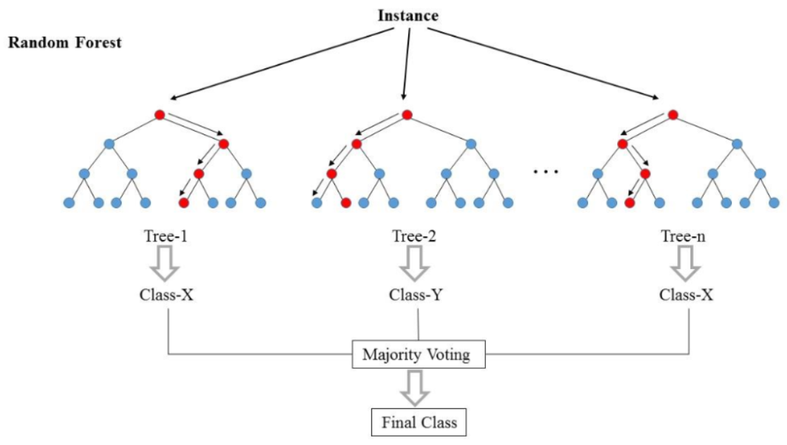
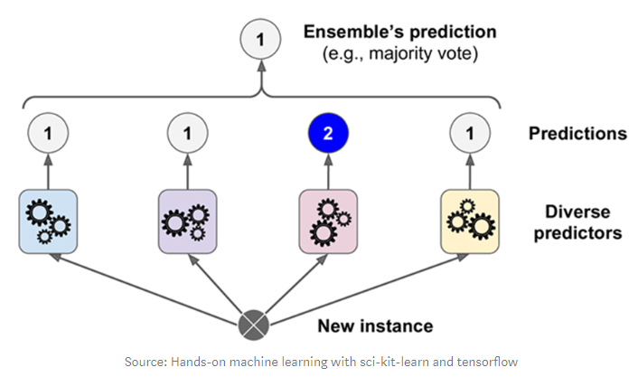
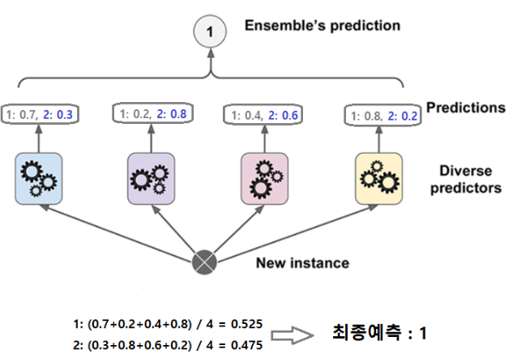

# 앙상블(Ensemble) 기법
- 하나의 모델만을 이용하는 것이 아니라 여러 모델을 학습시키고 결합하여 문제를 해결하는 방식
- 개별로 학습한 여러 모델을 조합해 과적합을 막고 일반화 성능을 향상시킬 수 있음
- 개별 모델의 성능이 확보되지 않을 때 성능향상에 도움이 될 수 있음

<br>

## 앙상블의 종류
### 1. 투표방식
- 여러개의 추정기(Estimator)가 낸 결과들을 투표를 통해 최종 결과를 내는 방식

<br>

- 종류
    1. **Bagging**
        - 같은 유형의 알고리즘들을 조합하되 각각 학습하는 데이터를 다르게 함
    2. **Voting**
        - 서로 다른 종류의 알고리즘들을 결합

<br>
    
### 2. 부스팅(Boosting)    
- 약한 학습기(Weak Learner)들을 결합해서 보다 정확하고 강력한 학습기(Strong Learner) 만듦
- 각 약한 학습기들은 순서대로 일을 하며 뒤의 학습기들은 앞의 학습기가 찾지 못한 부분을 추가적으로 찾음

<br>
<br>

# Random Forest (랜덤포레스트)
- **Bagging 방식**의 앙상블 모델
- Deccision Tree 기반 

<br>

<p align=center></p>

<br>

- 다수의 결정트리를 사용해서 성능을 올린 앙상블 알고리즘의 하나
    - 학습데이터를 샘플링해서 다수의 결정트리를 생성 후 이를 기반으로 다수결로 결과를 결정하는 방식
    - 다수의 결정트리를 만들어서 랜덤포레스트
- 처리속도가 빠르며 분류 성능도 높은 모델

<br>

- 랜덤포레스트의 절차
    - 결정트리의 개수를 하이퍼파라미터로 받음
    - 랜덤 포레스트를 구성하는 모든 결정트리가 서로 다르도록 구성
        - 각 트리는 **부트스트랩 샘플링**으로 데이터셋을 준비       
            - 중복을 허용하면서 랜덤하게 샘플링하는 방식
            - 총데이터의 수는 원래 데이터셋과 동일 하지만 일부는 누락되고 일부는 중복
        - 각 트리는 **전체 피처중 일부의 피처만** 랜덤하게 가짐
    - 각 트리별로 예측결과를 내고 분류의 경우 그 예측을 모아 **다수결 투표**의 결과가 클래스 결과
    - 회귀의 경우는 **예측 결과의 평균**이 결과

<br>

- **주요 하이퍼파라미터**
    - n_estimators
        - tree의 개수
        - 시간과 메모리가 허용하는 범위에서 클수록 조음
    - max_features
        - 각 트리에서 선택할 feature의 개수
        - 클수록 각 트리간의 feature 차이가 없어지고 작을 수록 차이가 커짐
    - max_depth, min_samples_leaf, ..
        - 랜덤 포레스트에 적용할 DecisionTreeClassifier의 하이퍼파라미터들

- 코드
    ```python
    from sklearn.datasets import load_breast_cancer
    from sklearn.model_selection import train_test_split
    from sklearn.ensemble import RandomForestClassifier
    from sklearn.metrics import accuracy_score

    # 데이터 로드 및 분할
    data = load_breast_cancer()
    X, y = load_breast_cancer(return_X_y=True)
    X_train, X_test, y_train, y_test = train_test_split(X, y, stratify=y, random_state=0)

    # 모델 생성, 학습
    rf = RandomForestClassifier(n_estimators=500,
                            max_depth = 5,
                            random_state=0,
                            n_jobs=-1)
    rf.fit(X_train, y_train)

    # 검증
    pred_train = rf.predict(X_train)
    pred_test = rf.predict(X_test)
    print("정확도 : ")
    print(accuracy_score(y_train, pred_train), accuracy_score(y_test, pred_test))

    # 특성 중요도 조회 및 시각하
    f = pd.Series(rf.feature_importances_, index = data['feature_names'])
    f.sort_values(ascending=True).plot(kind="barh")
    ```

<br>
<br>


# Voting

## Voting의 유형
- 최종 예측을 취합하는 방식에 따라 나뉨

<br>

1. **hard voting**
    - 다수의 추정기가 결정한 예측값들 중 많은 것을 선택하는 방식

    <br>

    <p align=center></p>

    <br>

2. **soft voting**
    - 다수의 추정기에서 각 레이블별 예측한 확률들의 평균을 내서 높은 레이블값을 결과값으로 선택하는 방식

    <br>

    <p align=center></p>

    <br>


- 일반적으로 soft voting이 성능이 더 좋음    
- Voting은 성향이 다르면서 비슷한 성능을 가진 모델들을 묶었을때 가장 좋은 성능을 냄

<br>
<br>

## VotingClassifier 클래스 이용
- 매개변수
    - estimators
        - 앙상블할 모델들 설정
        - ("추정기이름", 추정기) 의 튜플을 리스트로 묶어서 전달
    - voting
        - voting 방식
        - hard(기본값), soft  지정


<br>

- 코드 
    - **hard voting**
    ```python
    from sklearn.datasets import load_breast_cancer
    from sklearn.model_selection import train_test_split
    from sklearn.neighbors import KNeighborsClassifier
    from sklearn.ensemble import RandomForestClassifier
    from sklearn.ensemble import VotingClassifier
    from sklearn.svm import SVC
    from sklearn.metrics import accuracy_score
    from sklearn.preprocessing import StandardScaler

    # 데이터 로드 / 분류
    X, y = load_breast_cancer(return_X_y=True)
    X_train, X_test, y_train, y_test = train_test_split(X, y, stratify=y, random_state=0)

    # 전처리
    scaler = StandardScaler()
    X_train_scaled = scaler.fit_transform(X_train)
    X_test_scaled = scaler.fit_transform(X_test)

    # 각 모델 생성
    svc = SVC(random_state=0)
    knn = KNeighborsClassifier(n_neighbors=5)
    rf = RandomForestClassifier(n_estimators=200, max_depth=5, random_state=0)

    def print_metrics(y, pred, title=None):
        acc = accuracy_score(y, pred)
        if title:
            print(title)
        print("정확도 : ", acc)
        
        
    # voting
    estimators = [
        ("svc", svc),
        ("knn", knn),
        ("rf", rf)
    ]

    voting = VotingClassifier(estimators) # hardvoting

    # 각 모델 학습
    voting.fit(X_train_scaled, y_train)

    # 평가
    pred_train = voting.predict(X_train_scaled)
    pred_test = voting.predict(X_test_scaled)

    print_metrics(y_train, pred_train, "Voting Train Acc")
    print_metrics(y_test, pred_test, "Votingm Test Acc")
    ```

<br>

- 코드 
    - **soft voting**
    ```python
    from sklearn.datasets import load_breast_cancer
    from sklearn.model_selection import train_test_split
    from sklearn.neighbors import KNeighborsClassifier
    from sklearn.ensemble import RandomForestClassifier
    from sklearn.ensemble import VotingClassifier
    from sklearn.svm import SVC
    from sklearn.metrics import accuracy_score
    from sklearn.preprocessing import StandardScaler

    # 데이터 로드 / 분류
    X, y = load_breast_cancer(return_X_y=True)
    X_train, X_test, y_train, y_test = train_test_split(X, y, stratify=y, random_state=0)

    # 전처리
    scaler = StandardScaler()
    X_train_scaled = scaler.fit_transform(X_train)
    X_test_scaled = scaler.fit_transform(X_test)

    # 각 모델 생성
    svc = SVC(random_state=0, probability=True)
    knn = KNeighborsClassifier( n_neighbors=5)
    rf = RandomForestClassifier(n_estimators=200, max_depth=5, random_state=0)

    def print_metrics(y, pred, title=None):
        acc = accuracy_score(y, pred)
        if title:
            print(title)
        print("정확도 : ", acc)
        
        
    # voting
    estimators = [
        ("svc", svc),
        ("knn", knn),
        ("rf", rf)
    ]

    voting = VotingClassifier(estimators, voting='soft') # soft voting(확률 평균으로 결과를 예측)
    # soft voting 인 경우는 predict-proba가 나옴!


    # 각 모델 학습
    voting.fit(X_train_scaled, y_train)

    # 평가
    pred_train = voting.predict(X_train_scaled)
    pred_test = voting.predict(X_test_scaled)

    print_metrics(y_train, pred_train, "Voting Train Acc")
    print_metrics(y_test, pred_test, "Votingm Test Acc")
    ```

    <br>

- 코드 
    - **pipeline**

    ```python
    # pipe라인을이용하여 전처리+모델을 묶어서 VotingClassifier에 설정
    # SVM,KNN ; Feature scaleing(0) => pipeline

    from sklearn.datasets import load_breast_cancer
    from sklearn.model_selection import train_test_split
    from sklearn.neighbors import KNeighborsClassifier
    from sklearn.ensemble import RandomForestClassifier
    from sklearn.ensemble import VotingClassifier
    from sklearn.svm import SVC
    from sklearn.metrics import accuracy_score
    from sklearn.preprocessing import StandardScaler
    from sklearn.pipeline import Pipeline

    # 데이터 로드 / 분류
    X, y = load_breast_cancer(return_X_y=True)
    X_train, X_test, y_train, y_test = train_test_split(X, y, stratify=y, random_state=0)

    # pipeline
    order_knn =[
        ("scaler", StandardScaler()),
        ("knn", KNeighborsClassifier(n_neighbors=5))
    ]

    order_svc = [
        ("scaler", StandardScaler()),
        ("svc", SVC(random_state = 0, probability=True))
    ]


    knn_pl = Pipeline(order_knn)
    svc_pl = Pipeline(order_svc)
    rf = RandomForestClassifier(n_estimators=200, max_depth=5, random_state=0)


    def print_metrics(y, pred, title=None):
        acc = accuracy_score(y, pred)
        if title:
            print(title)
        print("정확도 : ", acc)
        
        
    # voting
    estimators = [
        ("svc", svc_pl),
        ("knn", knn_pl),
        ("rf", rf)
    ]

    voting = VotingClassifier(estimators, voting='soft') # soft voting(확률 평균으로 결과를 예측)
    # soft voting 인 경우는 predict-proba가 나옴!


    # 각 모델 학습
    voting.fit(X_train_scaled, y_train)

    # 평가
    pred_train = voting.predict(X_train_scaled)
    pred_test = voting.predict(X_test_scaled)

    print_metrics(y_train, pred_train, "Voting Train Acc")
    print_metrics(y_test, pred_test, "Votingm Test Acc")
    ```
    
