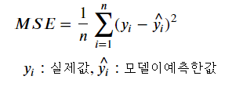

# 회귀(Regression)

- 지도 학습(Supervised Learning)으로 예측할 Target이 연속형데이터인 경우

## 회귀의 주요 평가 지표
예측값과 실제 값간의 차이를 구함

- ### MSE (Mean Squared Error)
    - 실제 값과 예측값의 차를 제곱해 평균 낸 것
    - mean_squared_error(y, pred_y) 
    - 'neg_mean_squared_error'
    - 오차가 제곱된 큰 값으로 나옴
    
     
    
    

    
     

- ### RMSE (Root Mean Squared Error)
    - MSE의 제곱근
        - MSE는 오차의 제곱한 값이므로 실제 오차의 평균보다 큰 값  
    - scikit-learn은 함수를 지원하지 않음 
        - MSE를 구한 뒤 np.sqrt()로 제곱근을 구함

     

     

     

- ###  (R square, 결정계수)
    - 평균으로 예측했을 때 오차(총오차) 보다 모델을 사용했을 때 얼마 만큼 더 좋은 성능을 내는지를 비율로 나타낸 값. 
    - 내가 만든 모델이 평균으로 예측했을 때 보다 얼마나 좋은지
    - 1에 가까울 수록 좋은 모델.
    - r2_score()
    - 'r2'
    - [참고](https://ko.khanacademy.org/math/statistics-probability/describing-relationships-quantitative-data/assessing-the-fit-in-least-squares-regression/a/r-squared-intuition)
    
     
    
    

     

-  &nbsp; : &nbsp; i번째 실제 값
-  &nbsp;: &nbsp;i번째 예측 값
-  &nbsp; : &nbsp; y의 평균    

