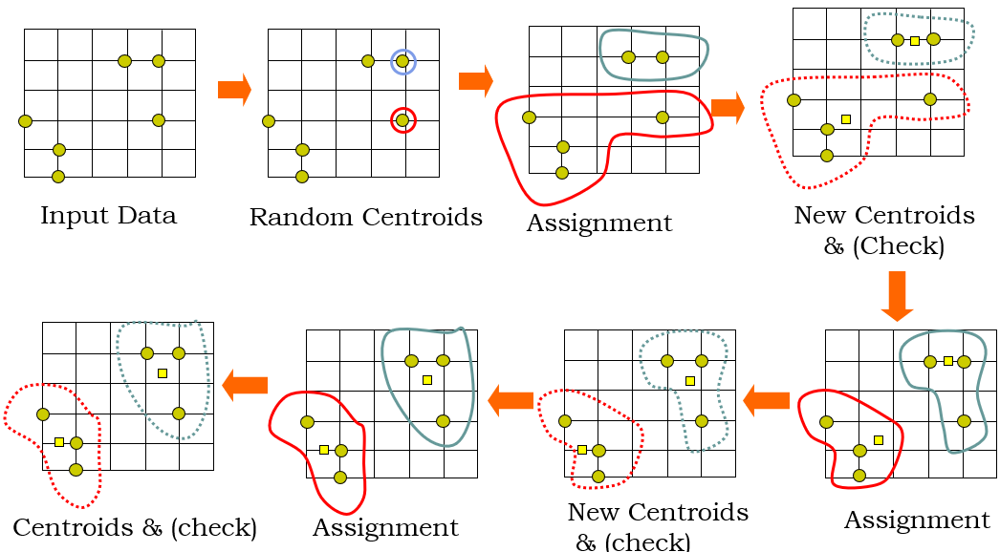

# 군집 (Clustering)
- 비지도 학습
- 비슷한 특성을 가지는 데이터들끼리 그룹으로 묶음

<br>
<br>

## 적용
- 고객 분류
    - 고객 데이터를 바탕으로 비슷한 특징의 고객들을 묶어 성향을 파악
- 이상치 탐지
    - 모든 군집에 묶이지 않는 데이터는 이상치일 가능성이 높음
- 준지도학습
    - 레이블이 없는 데이터셋에 군집을 이용해 Label 생성
    - 레이블 세분화 가능

<br>
<br>

## k-mean 
- 데이터셋을 K의 군집으로 나눔 
    K는 하이퍼파라미터
- 군집의 중심이 될 것 같은 임의의 지점(Centroid)을 선택해 해당 중심에 가장 가까운 포인드들을 선택하는 기법

<br>

<p align=center>
</p>
<center> <br>

[출처](http://ai-times.tistory.com/158)

<br> </center>


### 특징
- K-mean은 군집을 원 모양으로 간주
- 모든 특성은 동일한 Scale을 가져야 함 
- 이상치에 취약


<br>

### 평가  : **실루엣 지표**

- 실루엣 계수 (silhouette coefficient)
    - -1 ~ 1까지의 값을 가지나 보통 0에서 1까지의 값을 가짐
    - 데이터 하나당 계수값
    - 개별 관측치가 해당 군집 내의 데이터와 얼마나 가깝고 가장 가까운 다른 군집과 얼마나 먼지를 나타내는 지표
    - 1에 가까울 수록 좋은 지표 
    - 0에 가까울수록 다른 군집과 가까움을 의미
    - 0보다 작은 수 나오면 정말 안 좋은 것
    
     - a : 데이터와 같은 그룹에 있는 데이터 간들의 평균
     - b :  다른 데이터 그룹에 있는 데이터간의 평균
     - (b - a) / max(a, b)

<br>

- silhouette_samples()
    - 개별 관측치의 실루엣 계수 반환
- silhouette_score()
    - 실루엣 계수들을의 평균

<br>

- 좋은 군집화의 지표
    - 실루엣 계수 평균이 1에 가까울수록 좋음
    - 실루엣 계수 평균과 개별 군집의 실루엣 계수 평균의 편차가 크지 않아야 함


<br>
<br>

### 적정 군집수 판단
- inertia 
    - 군집내 데이터들과 중심간의 거리의 합으로 군집의 응집도를 나타내는 값
    - 값이 작을 수록 응집도가 높게 군집화가 잘되었다고 평가
    - KMean의 inertia_ 속성으로 조회
    - 군집 단위 별로 inertia 값을 조회한 후 급격히 떨어지는 지점이 적정 군집수라 판단

<br>
<hr>
<br>

- 코드

    <br>

    ```python
    import numpy as np
    import pandas as pd
    from sklearn.datasets import load_iris
    from sklearn.preprocessing import MinMaxScaler
    from sklearn.cluster import KMeans
    import matplotlib.pyplot as plt
    from sklearn.metrics import silhouette_samples, silhouette_score

    data = load_iris()
    X = data['data']
    y = data['target']

    scaler = MinMaxScaler()
    X_scaled = scaler.fit_transform(X)

    kmeans = KMeans(n_clusters=3, random_state=0)
    kmeans.fit(X_scaled)

    # 결과 확인
    df = pd.DataFrame(X,columns=data['feature_names'])
    df['cluster'] = kmeans.labels_
    df['Y_label'] = y
    df.iloc[40:70]

    print(df['cluster'].value_counts()) # 숫자는 중요한 것이 아니라 같은 종류끼리 묶였다는 것이 중요!!

    # 적정 군집수 판단
    print(kmeans.inertia_)

    k_list = [2, 3, 4, 5, 6, 7, 8, 9]
    inertia_list = []
    for k in k_list:
        km = KMeans(n_clusters=k, random_state=0)
        km.fit(X_scaled)
        inertia_list.append(km.inertia_)
        
    plt.figure(figsize=(7, 5))
    plt.plot(k_list, inertia_list)
    plt.show()

    # 평가

    s_coef = silhouette_samples(X_scaled, kmeans.labels_)
    print(len(s_coef))
    print(s_coef)
    print(np.mean(s_coef))
    df['실루엣계수'] = s_coef
    print(silhouette_score(X_scaled, kmeans.labels_))
    ```