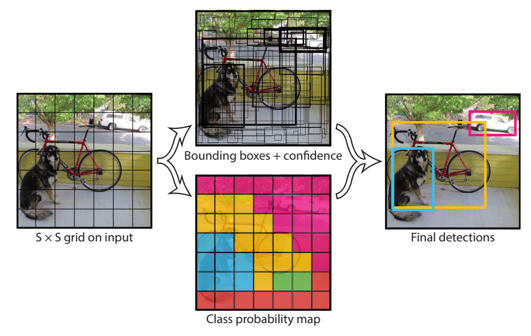
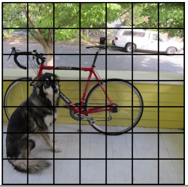
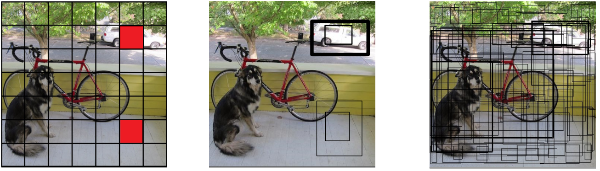
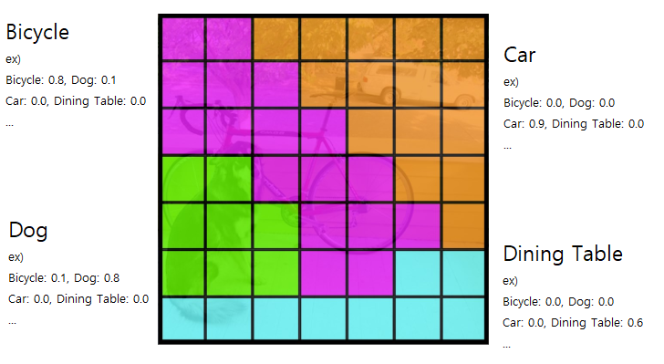
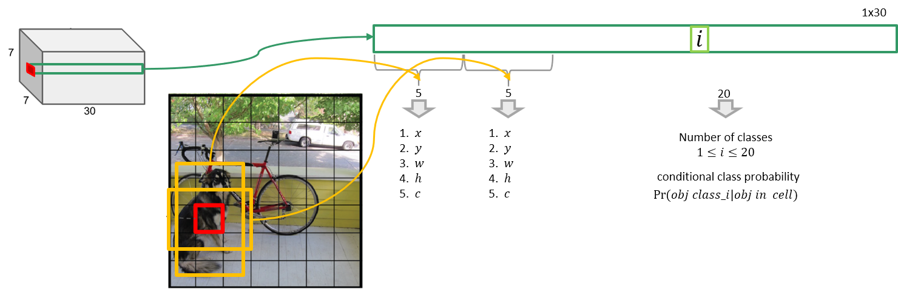
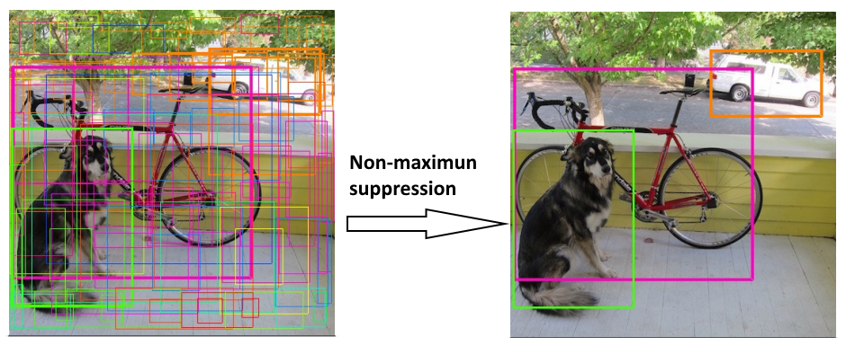
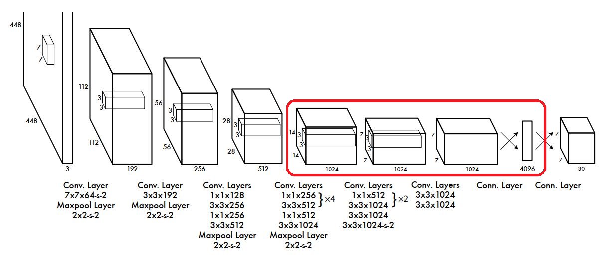

# [You Only Look Once: Unified, Real-Time Object Detection](https://arxiv.org/abs/1506.02640)

## 특징
- 2015년 발표된 Joseph Redmon, Alexey Bochkovskiy등이 발표한 One stage 계열의 object detection.
- C로 구현했으며 Darknet(version 2부터)이라는 자체 뉴럴네트워크 프레임워크를 사용
- 기존 2 stage 계열의 Faster R-CNN에 비해 약 6배 빠른 detection 속도를 보여 실시간 detection이 가능
- 정확도는 비교적떨어짐

 
 

## Unified Detection
- End to End 
    - 1 Stage Detection
    - YOLO는 후보영역 추출(Region Proposal)과 물체검출 및 분류(Object Dection & Classification)을 통합해 하나의 딥러닝 네트워크가 한번에 처리
    - Object Detection을 Single Regression Problem 으로 문제를 재정의
        - 기존 2 Stage Detection Regression은 localization만 의미
        - YOLO는 Classification의 오차를 MSE로 구함
        - 입력된 이미지로 부터 bounding box 좌표(coordinate)와 class 확률을 한번에 계산

 

### Yolo Prediction (추론 단계)

 

 

#### 1. 전체 이미지를 S X S 의 grid로 나눔 (S: 7)

 

 

#### 2-1. 각 Cell에서 Bounding Box와 Confidence 예측

 

- 각 cell에서 B개의 Bounding Box 존재 
- Bounidng Box에 대한 신뢰도(Confidence: P(Object))를 예측 
    - 이 논문에서 B: 2 
- Bounding Box는 (c, x, y, w, h) 5개의 값으로 구성된다. 
    - (x,y) : 중심점 좌표
    - (w,h) : bounding box의 너비와 높이
    - c는 해당 bounding box에 대한 신뢰도 점수(Confidence)
    - Confidence : &nbsp; 
        - 물체가 있을 확률 * IoU점수(Ground truth와 예측bbox간의 겹치는 부분의 넓이)

 

#### 2-2. 각 cell에서 검출(Detection)할 C개의 class 별 확률을 예측 (C: 20- Pascal voc dataset)

 

 

- Class일 확률 :  &nbsp; 
    - 물체가 존재할 때 특정 class 일 확률
- class에대한 확률예측은 bounding box 가 아니라 cell 단위로 진행
- Yolo는 배경을 class에 추가 하지 않음
    - 대부분의 Object Detection 알고리즘은 클래스개수 + 1을 하여 배경을 집어 넣어 확률을 예측 
    - Yolo는 배경을 포함시키지 않음
    - 배경 대신 confidence score를 이용해 처리
        - 물체가 없으면 confidence가 0 또는 낮은 score를 가지게 되므로 그 bounding box는 제거
            - 제거된다는 것은 감지하려는 물체가 아니라 배경이라고 할 수 있음

  

#### 3. 모델이 출력한 Bounding Box와 class 예측을 곱한 뒤 NMS 를 이용해 최종결과를 출력

- Yolo model은  shape의 3차원 Tensor로 출력
    - S: grid 개수 - (논문 - 7)
    - B: Grid별로 예측할 Bounding Box의 개수 (논문 - 2)
    - C: class개수 (논문에서는 Pascal VOC 데이터셋을 사용. Pascal VOC class개수 - 20개)
        - 논문의 최종 결과는 (7,7,(2*5+20)=>(7, 7, 30) shape으로 반환됨

 

- NMS를 이용해 최종 출력 결과

 

 
 

## Network Design
 

 

- 네트워크 구조는 단순한 Convolution Network 
    - 입력 이미지  : &nbsp;  
    - Bounding box 좌표(cx, cy, w,h) Ground Truth는 전체 이미지 width, height 기준의 비율로 normalize하여 0 ~ 1사이의 살수값을 사용
    - Activation Function으로 Leaky ReLU
    - 마지막 출력 Layer만 Linear Function

 

- Fully Connected Layer를 통과하여 나온 결과를 ($7 \times 7 \times 30$) 형태로 reshape해서 최종 결과로 출력한다.
    - FCN는 2개 존재
        - 4096, 1470
- 앞단의 20개의 Layer들은 Base Network(Backbone-특징 추출 네트워크))으로 $224 \times 224$ 크기 이미지넷 데이터셋으로 Pretrain의  시켰다.
- 학습시 Base Network(Backbone) 레이어들은 Frozen(고정) 시키고 위 그림의 붉은 Box의 Convolution Layer들을 Object Detection Task에 맞춰 Transfer Learning을 함.
- 마지막 conn.Layer는 reshape을 위함