#  Bag of freebies
- 보통 conventional object detector 오프라인으로 학습
- 연구자들은 이러한 장점을 살려, 모델의 inference 비용을 늘리지 않으면서 더 높은 정확도를 얻을 수 있도록 학습시키는 방법을 개발, 연구
- 학습 전력만 바꾸거나 학습 비용만 증가시켜 정확도를 높이는 방법을 **Bag of freebies** 라고 함

 
 

## 1.1 Data Augumentation
- 입력 이미지들에 대한 가변성을 늘려 object detetion model이 다른 환경에서 얻어지는 이미지들에 높은 강검함을 유지하게 만드는 것이 목적

 

### 1.1.1 pixel-wise-adjustment
-  photometric distortion
    - brightness
    - contrast
    - hue
    - saturation
    - noise

 

- geometric distortion
    - scaling
    - cropping
    - flipping
    - rotating

 

### 1.1.2 object occlusion 문제 해결
- 모델이 객체를 검출 할 때 객체가 서로 겹쳐서 검출이 잘 안되는 경우를 줄이기 위한 방법

 

- **random erase** 
    - 랜덤으로 사각형 영역을 선택하여 랜덤한 값으로 채우는 방법
    
     

    

    
<a ref="https://arxiv.org/pdf/1708.04896.pdf">출처</a>

- **CutOut**
    - 랜덤으로 사각형 영역을 선택하여 0의 값으로 보충하는 방법

     

    

    
<a ref="https://arxiv.org/pdf/1708.04552.pdf">출처</a>

- **hide-and-seek**
    - 랜덤하게 여러개의 사각형을 선택하여 0으로 값을 바꾸는 방법

     
    
    

    
<a ref="https://arxiv.org/pdf/1811.02545.pdf">출처</a>

 

- **grid mask**
    - 고정된 크기의 grid로 mask를 생성하여 이미지의 특정 부분을 사각형 모양으로 0으로 값을 바꾸는 방법 

     

    
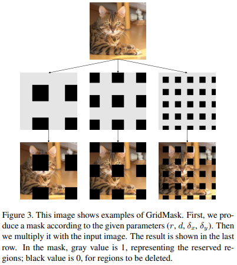

    
<a ref="https://arxiv.org/pdf/2001.04086.pdf">출처</a>

 

### 1.1.3 feature map
- DropOut
- DropConnect
- DropBlock

 

### 1.1.3 다수의 이미지 함께 이용
- **MixUp**
    - 2개의 이미지를 곱하여 다른 coefficient ratio로 중첩하고. 중접된 비율로 라벨을 조정하여 네트워크의 일반화 능력을 향상시키는 방법 

 

- **CutMix**
    - 사각형으로 자른 이미지를 다른 이미지에 붙여넣고, 섞인 영역의 사이즈에 따라 라벨을 조정하는 방법  

       

    
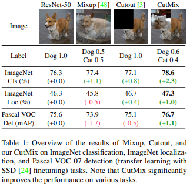

    
<a ref="https://arxiv.org/pdf/2001.04086.pdf">출처</a>

 

### 1.1.5 GAN
- **style transfer GAN**
    - CNN모델의 학습 결과로 얻어지는 texture bias를 효과적으로 줄이기 위한 방법
    - 기존 이미지의 형상은 유지하며 스타일은 내가 원하는 스타일로 바꾸는 것 

     

    
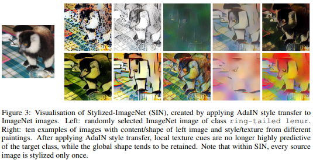

    
<a ref="https://arxiv.org/pdf/1811.12231.pdf">출처</a>

 
 

## 1.2 Sementic Distribution bias

### 1.2.1 class 불균형 문제 해결
#### 1.2.1.1 two stage object detector
- **Hard Negative Example Mining**
    - Hard Negative : 실제로는 Negative이나 Positive라고 예측하기 쉬운 데이터 
    - 모델이 잘못 판단한 False Positive를 학습 데이터에 추가하여 재학습하는 방법

 

- **Online Hard Example Mining**
    - 이미지에서 추출한 모든 RoI(Region of Interest)를 foward pass 한 후 loss를 계산하여 높은 loss를 가지는 RoI에 대해서만 back pass를 하는 방법 
    
### 1.2.1.2 one stage object detector
- **focal loss**
    - 기존의 cross entropy 식에 
     
    
    
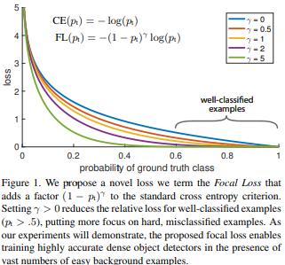

    
<a ref="https://arxiv.org/pdf/1708.02002.pdf">출처</a>

 

### 1.2.2 one-hot-encoding 서로 다른 categories 사이의 연관정도의 관계 표현 문제
- **label smoothing**
    - 데이터 라벨링의 실수 가능성을 포함
    - hard labeling을 soft labeling으로 바꿈
    - 즉, 정답 인덱스는 1, 나머지는 0인 구성에서 K 개의 class에 대해

- **Label refinement network**
    - 더 좋은 soft labeling을 하기 위한 방법 

 
 

## 1.3 Objective function of Bounding box regression
### 1.3.1 Anchor-base method
- **MSE**
    -  bbox의 중심점의 좌표, 높이, 너비에 대해 regression을 수행하는 loss function
    - L2 loss
    
     

### 1.3.2 IoU loss
bbox의 중심점의 좌표, 높이, 너비에 대해 regression을 수행하는 loss function  
각 점들의 좌표를 독립적 변수로 고려하여 객체 자체의 integrity를 고려하지 못함 

 

- **IoU**
    - Bounding Box(bbox)와 Ground Truth Bounding Box(정답)가 얼마나 겹치는지를(Overlap) 나타내는 지표
  
 

- **GIoU(Generalized IoU)**
    - IoU는 겹쳐지지 않는 박스가 있다면 얼마나 떨어져있는지 학습 할 수 없음
    - Bounding Box와 Ground Truth Box를 동시에 감싸는 최소 영역을 만들고 그 영역을 이용하여 Bounding Box와 Ground Truth Box가 얼마나 떨어져있는지 반영

 

- **DIoU(Distance IoU)**
    - 객체 간의 중심점 사이의 거리를 고려

    
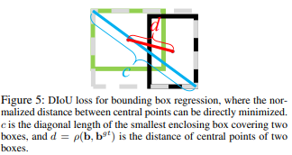

    
<a ref="https://arxiv.org/pdf/1911.08287.pdf">출처</a>

 

- **CIoU**
    - 

 
 
 

# 2 Bag of specials
- plugin 모듈과 후처리로 추론 비용을 조금 증가시키지만 object detection의 정확도를 크게 향상시키는 방법을 **Bag of specials** 라고 함

 

## 2.1 receptive field 증가 
<!-- 커널이 적용되는 영역으로 feature map 의 한 노드 -->
- **SPP (Spatial Pyramid Pooling)**
    - SPM 기법에서 발전한 방법
        
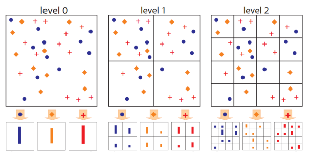

            
        - level 0에서 이미지 전체에 대해서 하나의 히스토그램을 구함 (위의 그림처럼 특징이 3인 경우 3개의 값 나옴)
        - level1에서는 4등분을 한 이미지에서 각 영역마다 특징을 뽑아 히스토그램 구함 (4x3=12)
        - level에서는 16등분을 한 영역마다 특징을 뽑아 히스토그램을 구함 (16x3= 48)
        - 3 + 12+ 48 개 원소의 vector 구성
        - 어떤 Feature들이 많이 나타나면 어떤 이미지일 것이라는 추론이 가능

     

    
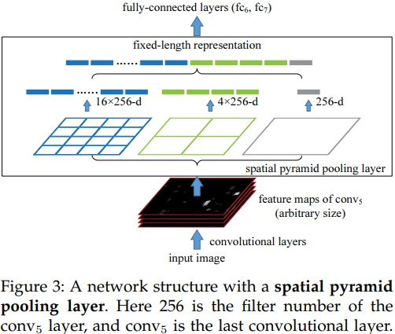

    
<a ref="https://arxiv.org/pdf/1406.4729.pdf">출처</a>

     

    - SPP는 딥러닝에 최적화 하기 위해 SPM에서 나온 벡터들에 maxPooling 적용하여 1+4+16 개 원소의 vector 구성 (위의 예제)
    - 1차원의 feature vector를 출력하기 때문에 Fully Convolutional Network (FCN)에 적용 불가
    - YOLOv3 는 k x k(k={1, 5, 9, 13}) kernel size와 stride=1를 가진 max-pooling 출력을 concatenation하여 SPP module 개선
    - 비교적 큰 k x k max-pooling으로 backbone feature의 receptive field를 효과적으로 증가시킬 수 있음
    
     

 

- **ASPP (Atrous Spatial Pyramid Pooling)**
    - atrous convolution (dilated convolution)
        - 커널 사이의 간격을 정의하는 dilation rate 도입
        
         

        
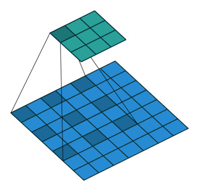

        
<a ref="https://zzsza.github.io/data/2018/02/23/introduction-convolution/">출처</a>

    - SPP에 atrous convolution 적용하여 ASSP

     

    
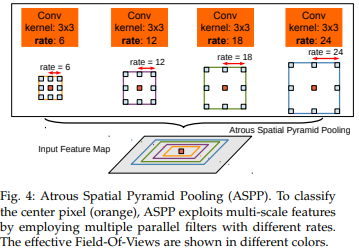

    
<a ref="https://arxiv.org/pdf/1606.00915.pdf">출처</a>

     

    - dilation rate을 {6, 12, 18, 24}로 다양하게 적용
    
     
    
    
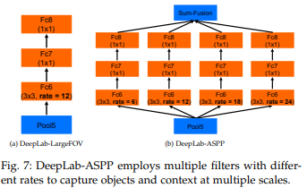

    
<a ref="https://arxiv.org/pdf/1606.00915.pdf">출처</a>

 

- **RFB (Receptive Field Block)**
    - ligthweight backbone에 hand-crafted mechanism으로 만들어진 RFBlock을 플러그인 함으로써 가벼움을 유지한채 robustness하고 discriminability를 갖는 feature를 만드는 Detector

     

    
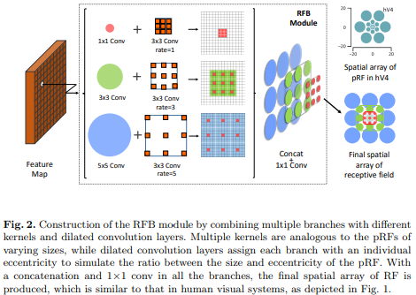

    
<a ref="https://arxiv.org/pdf/1606.00915.pdf">출처</a>

    
     

    - k x k kernel의 여러개 dilated convolution 사용하고 dilated ratio는 k와 같음 
    - stride는 1과 같으므로 ASPP보다 포괄적인 spatial coverage를 얻을 수 있음

     

## 2.2 attention module
### 2.2.1 channel-wise attention
- **SE (Squeeze-and-Excitation)**

     

    
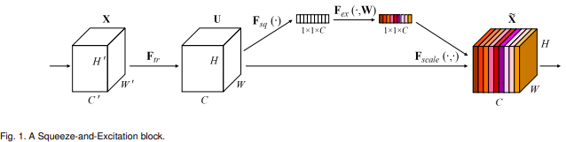

    
<a ref="https://arxiv.org/pdf/1709.01507.pdf">출처</a>

    - Squeeze
### 2.2.2 pointwise attention
- **SAM ( Spatial Attention Module)**