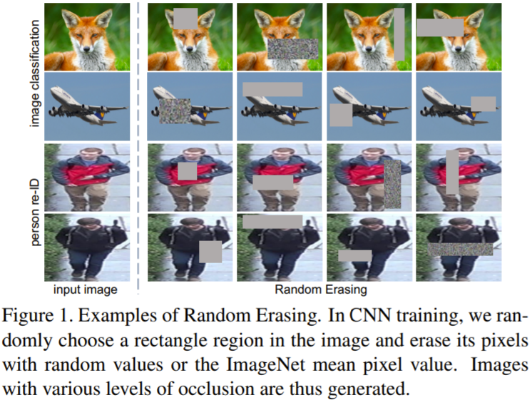
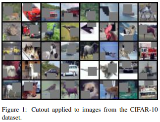
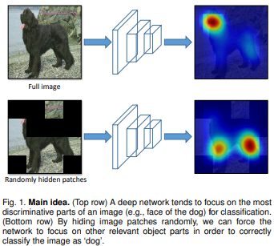

#  Bag of freebies
- 보통 conventional object detector 오프라인으로 학습
- 연구자들은 이러한 장점을 살려, 모델의 inference 비용을 늘리지 않으면서 더 높은 정확도를 얻을 수 있도록 학습시키는 방법을 개발, 연구
- 학습 전력만 바꾸거나 학습 비용만 증가시켜 정확도를 높이는 방법을 **Bag of freebies** 라고 함

 
 

## 1.1 Data Augumentation
- 입력 이미지들에 대한 가변성을 늘려 object detetion model이 다른 환경에서 얻어지는 이미지들에 높은 강검함을 유지하게 만드는 것이 목적

 

### 1.1.1 pixel-wise-adjustment
-  photometric distortion
    - brightness
    - contrast
    - hue
    - saturation
    - noise

 

- geometric distortion
    - scaling
    - cropping
    - flipping
    - rotating

 

### 1.1.2 object occlusion 문제 해결
- 모델이 객체를 검출 할 때 객체가 서로 겹쳐서 검출이 잘 안되는 경우를 줄이기 위한 방법

 

- **random erase** 
    - 랜덤으로 사각형 영역을 선택하여 랜덤한 값으로 채우는 방법
    
     

    

    
<a ref="https://arxiv.org/pdf/1708.04896.pdf">출처</a>

- **CutOut**
    - 랜덤으로 사각형 영역을 선택하여 0의 값으로 보충하는 방법

     

    

    
<a ref="https://arxiv.org/pdf/1708.04552.pdf">출처</a>

- **hide-and-seek**
    - 랜덤하게 여러개의 사각형을 선택하여 0으로 값을 바꾸는 방법

     
    
    

    
<a ref="https://arxiv.org/pdf/1811.02545.pdf">출처</a>

- **grid mask**
    - 고정된 크기의 grid로 

 

### 1.1.3 feature map
- DropOut
- DropConnect
- DropBlock

 

### 1.1.4
- MixUp
- CutMix

 

### 1.1.5 GAN
- style transfer GAN

 
 

## 1.2 Sementic Distribution에 bias 문제 해결
### 1.2.1 hard negative example mining

### 1.2.2 online hard example mining