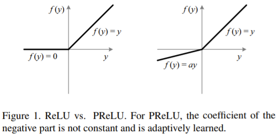

#  Bag of freebies
- 보통 conventional object detector 오프라인으로 학습
- 연구자들은 이러한 장점을 살려, 모델의 inference 비용을 늘리지 않으면서 더 높은 정확도를 얻을 수 있도록 학습시키는 방법을 개발, 연구
- 학습 전력만 바꾸거나 학습 비용만 증가시켜 정확도를 높이는 방법을 **Bag of freebies** 라고 함

 
 

## 1.1 Data Augumentation
- 입력 이미지들에 대한 가변성을 늘려 object detetion model이 다른 환경에서 얻어지는 이미지들에 높은 강검함을 유지하게 만드는 것이 목적

 

### 1.1.1 pixel-wise-adjustment
-  photometric distortion
    - brightness
        - 이미지 밝기 조절
    - contrast
        - 이미지 대비 조절 
    - hue
        - 이미지 색조 조절 
    - saturation
        - 이미지 채도 조절
    - noise
        - 이미지에 노이즈 추가

 

- geometric distortion
    - scaling
        - 이미지 크기 조절
    - cropping
        - 이미지 일부분 자르기
    - flipping
        - 이미지 뒤집기
    - rotating
        - 이미지 회전

 

### 1.1.2 Simulating object occlusion
- 모델이 객체를 검출 할 때 객체가 서로 겹쳐서 검출이 잘 안되는 경우를 가정하고 이를 줄이기 위한 방법 연구

 

- **Random erase** 
    - 랜덤으로 사각형 영역을 선택하여 랜덤한 값으로 채우는 방법
    
     

    

    
<a ref="https://arxiv.org/pdf/1708.04896.pdf">출처</a>

- **CutOut**
    - 랜덤으로 사각형 영역을 선택하여 0의 값으로 보충하는 방법

     

    

    
<a ref="https://arxiv.org/pdf/1708.04552.pdf">출처</a>

- **Hide-and-seek**
    - 랜덤하게 여러개의 사각형을 선택하여 0으로 값을 바꾸는 방법

     
    
    

    
<a ref="https://arxiv.org/pdf/1811.02545.pdf">출처</a>

 

- **Grid mask**
    - 고정된 크기의 grid로 mask를 생성하여 이미지의 특정 부분을 사각형 모양으로 0으로 값을 바꾸는 방법 

     

    

    
<a ref="https://arxiv.org/pdf/2001.04086.pdf">출처</a>

 

### Feature map 관점
Feature map에도 위와 비슷하게 적용되는 방법 존재

- **DropOut**
    - 랜덤으로 일부 뉴런을 생략하여 학습하는 방법

 

- **DropConnect**
    - 뉴런 간의 connection을 생략하여 학습하는 방법
    - 즉, 결과적으로는 weight를 생략하는 것

     
    
    

    
<a ref="https://stats.stackexchange.com/questions/201569/what-is-the-difference-between-dropout-and-drop-connect">출처</a>

 

- **DropBlock**

     

    

    
<a ref="https://stats.stackexchange.com/questions/201569/what-is-the-difference-between-dropout-and-drop-connect">출처</a>

     

    - 그림에서 초록색영역은 중요한 정보를 담고 있는 픽셀
    - DropOut으로 무작위로 unit 제거하는 것은 효과적이지 않음
        - 제거된 pixel 주변에 있는 pixel이 밀접한 관련이 있는 정보 포함하기 때문
    - 확실하게 정보를 제거하기 위해 연속된 영역을 제거하는 방법을 DropBlock

 

### 1.1.3 다수의 이미지 함께 이용
- **MixUp**
    - 2개의 이미지를 곱하여 다른 coefficient ratio로 중첩하고. 중접된 비율로 라벨을 조정하여 네트워크의 일반화 능력을 향상시키는 방법 

 

- **CutMix**
    - 사각형으로 자른 이미지를 다른 이미지에 붙여넣고, 섞인 영역의 사이즈에 따라 라벨을 조정하는 방법  

       

    

    
<a ref="https://arxiv.org/pdf/2001.04086.pdf">출처</a>

 

### 1.1.5 GAN
- **style transfer GAN**
    - CNN모델의 학습 결과로 얻어지는 texture bias를 효과적으로 줄이기 위한 방법
    - 기존 이미지의 형상은 유지하며 스타일은 내가 원하는 스타일로 바꾸는 것 

     

    

    
<a ref="https://arxiv.org/pdf/1811.12231.pdf">출처</a>

 
 

## 1.2 Sementic Distribution bias

### 1.2.1 class imbalance
#### 1.2.1.1 two stage object detector
- **Hard Negative Example Mining**
    - 모델은 주로 False Positive 오류를 생성 
        - Object의 위치에 해당하는 positive sample보다 배경에 해당하는 negative sample이 훨씬 많기에 발생
    - Hard Negative : 실제로는 Negative이나 Positive라고 예측하기 쉬운 데이터 
    - 모델이 잘못 판단한 False Positive를 학습 데이터에 추가하여 재학습하는 방법

 

- **Online Hard Example Mining**
    - 이미지에서 추출한 모든 RoI(Region of Interest)를 foward pass 한 후 loss를 계산하여 높은 loss를 가지는 RoI에 대해서만 back pass를 하는 방법 

 

### 1.2.1.2 One stage object detector
- One stage degector는 학습 중 배경에 많은 box를 치기 때문에 class imbalance 문제가 많이 생김
    - 즉 대부분은 학습에 기여하지 않는 easy negative(etector에 의해 background로 쉽게 분류)되어 학습에 비효율적
    - easy negative는 각각의 loss의 값은 작으나 수가 많아 easy negative에 대한 영향력이 매우 커짐

- **Focal loss**
    - Cross entropy

         

        

        

        
         

        - 모든 sample에 대한 예측 결과에 동등한 가중치 적용
            - 어떠한 sample이 쉽게 분류될 수 있음에도 불구하고 작지 않은 loss를 유발 
            
     

    - Balanced Cross Entropy

         

        

        
         

        - 비율이 다른 점을 개선하기 위하여 Cross Entropy Loss 자체에 비율을 보상하기 위한 값 곱해주는 방법
    
     

    - Focal loss는 easy example을 down-weight하여 hard negative sample에 집중하는 loss function 

     

    

    
<a ref="https://arxiv.org/pdf/1708.02002.pdf">출처</a>

 

### 1.2.2 one-hot-encoding representation 
- 서로 다른 categories 사이의 연관정도의 관계 표현 문제
- **Label smoothing**
    - 데이터 라벨링의 실수 가능성을 포함
    - hard labeling을 soft labeling으로 바꿈
    - 즉, 정답 인덱스는 1, 나머지는 0인 구성에서 K 개의 class에 대해

     

    

    
 &nbsp;: 정답이면 1, 아니면 0 

    
 &nbsp;: hyper-parameter 

    
 &nbsp;: class 수 

     

- **Label refinement network**
    - 더 좋은 soft labeling을 하기 위한 방법 

 
 

## 1.3 Objective function of Bounding box regression
### 1.3.1 Anchor-base method
- **MSE**
    -  bbox의 중심점의 좌표, 높이, 너비에 대해 regression을 수행하는 loss function
    - L2 loss
    
     

### 1.3.2 IoU loss
- bbox의 중심점의 좌표, 높이, 너비에 대해 regression을 수행하는 loss function
- 각 점들의 좌표를 독립적 변수로 고려하여 객체 자체의 integrity를 고려하지 못함 

 

- **IoU**
    - Bounding Box(bbox)와 Ground Truth Bounding Box(정답)가 얼마나 겹치는지를(Overlap) 나타내는 지표

     

    

    
 

- **GIoU(Generalized IoU)**
    - IoU는 겹쳐지지 않는 박스가 있다면 얼마나 떨어져있는지 학습 할 수 없음
    - Bounding Box와 Ground Truth Box를 동시에 감싸는 최소 영역을 만들고 그 영역을 이용하여 Bounding Box와 Ground Truth Box가 얼마나 떨어져있는지 반영

 

- **DIoU(Distance IoU)**
    - 객체 간의 중심점 사이의 거리를 고려

    

    
<a ref="https://arxiv.org/pdf/1911.08287.pdf">출처</a>

 

- **CIoU**
    - 

 
 
 

# 2 Bag of specials
- Plugin 모듈과 후처리로 추론 비용을 조금 증가시키지만 object detection의 정확도를 크게 향상시키는 방법을 **Bag of specials** 라고 함 
 

## 2.1 receptive field 증가 
<!-- 커널이 적용되는 영역으로 feature map 의 한 노드 -->
- **SPP (Spatial Pyramid Pooling)**
    - SPM 기법에서 발전한 방법
    - SPM

         

        

         

        - level 0에서 이미지 전체에 대해서 하나의 히스토그램을 구함 (위의 그림처럼 특징이 3인 경우 3개의 값 나옴)
        - level1에서는 4등분을 한 이미지에서 각 영역마다 특징을 뽑아 히스토그램 구함 (4x3=12)
        - level에서는 16등분을 한 영역마다 특징을 뽑아 히스토그램을 구함 (16x3= 48)
        - 3 + 12+ 48 개 원소의 vector 구성
        - 어떤 Feature들이 많이 나타나면 어떤 이미지일 것이라는 추론이 가능

         

    

    
<a ref="https://arxiv.org/pdf/1406.4729.pdf">출처</a>

     

    - SPP는 딥러닝에 최적화 하기 위해 SPM에서 나온 벡터들에 maxPooling 적용하여 1+4+16 개 원소의 vector 구성 (위의 예제)
    - 1차원의 feature vector를 출력하기 때문에 Fully Convolutional Network (FCN)에 적용 불가
    - YOLOv3 는 k x k(k={1, 5, 9, 13}) kernel size와 stride=1를 가진 max-pooling 출력을 concatenation하여 SPP module 개선
    - 비교적 큰 k x k max-pooling으로 backbone feature의 receptive field를 효과적으로 증가시킬 수 있음
    
     

 

- **ASPP (Atrous Spatial Pyramid Pooling)**
    - atrous convolution (dilated convolution)
        - 커널 사이의 간격을 정의하는 dilation rate 도입
        
         

        

        
<a ref="https://zzsza.github.io/data/2018/02/23/introduction-convolution/">출처</a>

    - SPP에 atrous convolution 적용하여 ASSP

     

    

    
<a ref="https://arxiv.org/pdf/1606.00915.pdf">출처</a>

     

    - dilation rate을 {6, 12, 18, 24}로 다양하게 적용
    
     
    
    

    
<a ref="https://arxiv.org/pdf/1606.00915.pdf">출처</a>

 

- **RFB (Receptive Field Block)**
    - ligthweight backbone에 hand-crafted mechanism으로 만들어진 RFBlock을 플러그인 함으로써 가벼움을 유지한채 robustness하고 discriminability를 갖는 feature를 만드는 Detector

     

    

    
<a ref="https://arxiv.org/pdf/1606.00915.pdf">출처</a>

    
     

    - k x k kernel의 여러개 dilated convolution 사용하고 dilated ratio는 k와 같음 
    - stride는 1과 같으므로 ASPP보다 포괄적인 spatial coverage를 얻을 수 있음

     

## 2.2 attention module
### 2.2.1 channel-wise attention
- **SE (Squeeze-and-Excitation)**

     

    

    
<a ref="https://arxiv.org/pdf/1709.01507.pdf">출처</a>

    - Squeeze
        - 채널 별 가중치를 계산하기 위해 global average pooling 으로 1차원으로 만들어 각 채널을 하나의 숫자로 표현하는 것 가능
    - Excitation
        - Squeeze에서 얻은 feature map에 2개의 fully-connected-layer 적용하여 상대적 중요도를 구함
        - 두번째 fully-connected layer에서 sigmoid 을 activation function 지정하여 0~1 사이의 값으로 channel 별 중요도 파악 가능
    - Recalibration
        -  channel별 중요도와 원본 feature map을 channel별로 곱하여 channel별로 중요도를 재보정
            
         

    

    
<a ref="https://arxiv.org/pdf/1709.01507.pdf">출처</a>

 

### 2.2.2 pointwise attention
- **SAM (Spatial Attention Module)**

     
    
    

    
<a ref="https://arxiv.org/pdf/1807.06521v2.pdf">출처</a>

     

    - 어디에 중요한  중요한 정보가 있는지 집중하게 함
    - Channel Attention Module과 Input Feature Map을 곱하여 생성한 F`에서 채널을 축으로 1xHxW의 F_avg 와 F_max 두 값을 concatenate 
    - 그 값에 7x7 convolution 연산을 적용하여 Spatial Attention Map 생성

     

    

    
<a ref="https://arxiv.org/pdf/1807.06521v2.pdf">출처</a>

     

## 2.3 feature integration
- 초기에는 skip connection 또는 hyper-column과 같은 방법들을 이용하여 low-level의 물리적 특성과 high-level의 sementic 특징을 통합함

-  FPN (Feature Pyramid Networks) 이후의 연구

    - FPN

         

        

        
<a ref="https://openaccess.thecvf.com/content_cvpr_2017/papers/Lin_Feature_Pyramid_Networks_CVPR_2017_paper.pdf">출처</a>

         

        - top-down pathway와 lateral connection을 사용하여 고해상도, 저해상도 feature map을 결합 
        - 이로 인해 feature pyramid는 모든 scale의 정보를 담고있고 하나의 이미지로부터 빠르게 계산되기 때문에, speed, memory, power의 손실 없이 사용 가능
        - feature pyramid의 각 level에서 prediction이 독립적으로 수행

         

        

        
<a ref="https://openaccess.thecvf.com/content_cvpr_2017/papers/Lin_Feature_Pyramid_Networks_CVPR_2017_paper.pdf">출처</a>

         
        
        - Bottom-up PathWay
            - backcbone의 convolution 연산
            - 동일한 크기의 feature map을 생성하는 layer들을 동일한 stage로 묶음

        - Top-Down Pathway and Lateral Connection
            - Top-down pathway
                - 상위 feature map을 nearest neighbor upsamling 기법을 적용하여 해상도를 2배씩 키움
            - Lateral connection 
                - bottom-up pathway와 top-down pathway에서 같은 크기의 feature map을 결합 
                - bottom-up pathway의 feature map에 1x1 conv를 적용하여 feature map의 channel을 감소시킨 뒤에 단순히 top-down pathway feature map에 더하여 계산

 

- **SFAM (Scale-wise Feature Aggregation Module)** 

     

    

    
<a ref="https://arxiv.org/pdf/1811.04533v3.pdf">출처</a>

     

    -  Scale-wise feature concatenation
        
         
        
        

        
<a ref="https://herbwood.tistory.com/23">출처</a>

        
         

        - 각각의 TUM은 특정 level에 관련된 feature maps를 출력
        - TUM으로부터 생성된 multi-level feature map을 같은 scale별로 concat하는 작업을 수행
    
     

    - Channel-wise attention
        - feature가 가장 많은 효율을 얻을 수 있는 channel에 집중(attention)하도록 설계하는 작업을 수행
        -  Scale-wise feature concatenation 과정에서 출력한 feature map을 SE(Squeeze Excitation) block에 입력 
    - 
    -

- **ASFF (Adaptively Spatial Feature Fusion)**
     

    

    
<a ref="https://arxiv.org/pdf/1911.09516v2.pdf">출처</a>

     

    - Feature resize
    - Adaptive Fusion
        - oftmax를 사용한 후 서로 다른 scale들의 feature map들을 추가함

     

- **BiFPN**
    
     

    

    
<a ref="https://arxiv.org/pdf/1911.09516v2.pdf">출처</a>

     

    - Cross-Scale Connection
        - 기존 FPN은 한방향으로 정보가 흐름
        - PANet은 bottom-up 추가
        - NAS-FPN
        - BiFPN은 양방향(top-down, bottom-up)을 지닌 레이어를 여러개 쌓음
        - directional한 레이어를 여러개 쌓아 high-level feature fusion이 가능

    - Weighted Feature Fusion
        - FPN내의 모든 input features는 output feature에 동일하지 않은 영향력을 갖음
        - 이 문제 해결 위해 각 input feature의 중요도에 따라 가중치를 가함 (Fast normalized fusion)

 
 

## 2.4 activation function
- **ReLU** 
    - 기존에 많이 사용한 tanh, sigmoid 에서 생기는 gradient vanish 문제 해결
    
     

- **LReLU ((Leaky ReLU))**
    - 기존 ReLU 함수에서 음수값에 대하여 gradient가 0이 되지 않도록 작은 값(default=0.01)을 곱해준 함수
    - dying ReLU 해결

     

- **PReLU((Parametric ReLU))**
    
     
    
    

    
<a ref="https://arxiv.org/pdf/1502.01852.pdf">출처</a>

    - ReLU 에서 음수값의 계수를 학습 가능한 파라미터로 두고 학습을 통해서 업데이트 시키는 activation function 
    - dying ReLU 해결

    

 

- **ReLU6**
    - ReLU 최대값을 6으로 지정해 효율적인 최적화가 가능한 activation function 
    - MobileNet에서 주로 사용
    - quantization networks을 위해 design 
    
 

- **SELU ( Scaled Exponential Linear Unit)**

     
    

    
<a ref="https://arxiv.org/pdf/1502.01852.pdf">출처</a>

    - self-normalizing 위해 고안

 

- **Swish**
    
     
    
    

    
<a ref="https://arxiv.org/pdf/1710.05941.pdf">출처</a>

     

    - continuously differentiable한 activation function이라는 점이 주목해야 할 사항    
    
     

- hard-Swish
    - 임베디드 기기에서는 Swish 함수에서 sigmoid에 대한 연산량이 높기 때문에 이러한 문제를 해결하기 위해 적용한 함수
    - quantization networks을 위해 design 

     

- Mish
    - upper bound가 없어 캡핑으로 인한 포화가 발생하지 않으며, 약간의 음수를 허용하여 gradient가 잘 흐르도록 설계된 activation function 
    - continuously differentiable한 activation function이라는 점이 주목해야 할 사항 
 

 

## 2.5 post-processing
- **Greedy NMS**
    - 높은 confidence score를 가지는 bounding box를 기준으로, 임계치 이상의 IoU 값을 가지는 bounding box를 제거하는 일반적인 NMS 방법 

     

- **Soft NMS**
    - greedy NMS에서는 object의 occlusion으로 confidence score가 IoU score와 함께 줄어들 수 있다는 문제
    - confidence score가 높은 bounding box와 임계치 이상의 IoU 값을 가지는 bounding box에 대해 confidence score를 0으로 만들지 말고 줄여서 최종 mAP를 향상시키는 방법 

     

- **DIoU NMS**
    - NMS 임계치에 DIoU penalty term을 추가하여 겹친 객체에 대한 성능을 향상시킨 NMS 방법 