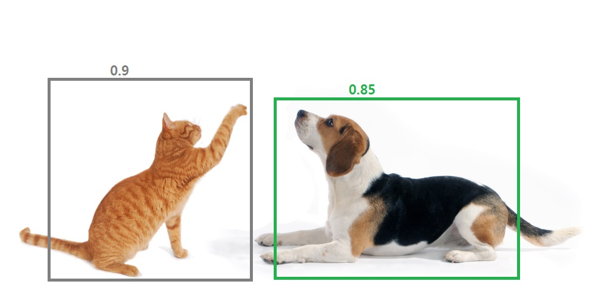

# Model 추론 결과 후처리 (Post Processing)
## NMS(Non Max Suppression)
- Object Dection 알고리즘은 Object가 있을 것이라 예측하는 위치에 여러개의 bounding Box들을 예측
- NMS는 Detect(검출)된 Bounding Box들 중에서 비슷한 위치에 있는 겹치는bbox들을 제거하고 가장 적합한 bbox를 선택하는 방법
    

    

### NMS 실행 로직
1. Detect(검출)된 Bounding Box 중 Confidence threshold 이하의 박스들 제거
> Confidence score: bounding box 내에 object(물체)가 있을 확률
2. 가장 높은 confidence score를 가진 bounding box 순서대로 내림차순 정렬
3. 높은 confidence score를 가진 bounding box와 겹치는 다른 bounding box를 모두 조사하여 IoU가 특정 threshold 이상인 bounding box들을 모두 제거(ex: IoU threshold > 0.5)
    - 가장 높은  confidence score를 가진 bounding box와 IoU가 높게 나온다는 것은 같은 물체를 예측한 bounding box일 가능성이 높음
    - 이 작업을 남아있는 모든 bounding box에 적용한 뒤 남아있는 박스만 선택
       

    

> 1. 0.9, 0.85, 0.8, 0.75, 0.75, 0.65 의 confidence score 순으로 정렬
> 2. 0.9인 bbox를 기준으로 각 bbox와 IoU를 계산
>    - 0.9(고양이)와 0.85(개)은 IoU가 0 이기 때문에 0.85는 유지
>    - 0.9(고양이)와 0.8(고양이)은 높은 IoU 값 가짐 (e:  0.8) 
        - 같은 object에 대한 bbox라고 할 수있으므로 0.8은 제거
>    - 위와 같이 bbox들을 제거해 나가면 confidence 높은 것만 bbox만 남기고 중복되는 다른 box들 제거 가능

    

