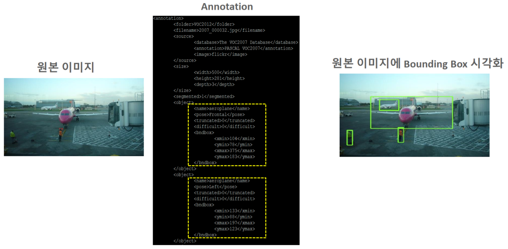
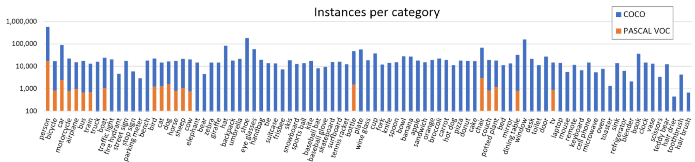

# Object Detection을 위한 주요 Open Dataset

## Open Dataset이란
- 2009년 ImageNet 데이터셋 이후 다양한 단체들에서 Object Detection, semantic segmentation, pose estimation 등 다양한 컴퓨터 비전 문제에 활용할 수 있는 Image Dataset을 제공
- Computer Vision을 위한 Open Dataset 들은 이미지와 그 이미지에 대한 문제영역 관련 Annotation 파일을 제공

## Annotation이란
- 학습시킬때 필요한 정보를 제공하는 문서(text) 파일
- 보통 각 이미지파일의 위치, 학습시 필요한 출력 정보(y, output)등을 제공한다.
    - 출력 정보: 이미지내의 Object(물체)들의 Bounding Box 위치정보, Object의 Label, segmentation 파일위치 등.
- Open Dataset마다 작성 포멧이 다르지만 보통 **JSON**, **XML**, **CSV**등을 사용

### Annotation 예
<p align="center">
  
</p>

## PASCAL VOC(Visual Object Classes)
- http://host.robots.ox.ac.uk/pascal/VOC/
- 2005년에서 2012년까지 열렸던 VOC challenges 대회에서 사용한 데이터셋
- 각 대회별 데이터셋을 Open Dataset으로 제공
    - 이 중 2007년도와 2012년도 이미지가 많이 쓰임
    - [PASCAL VOC 2007 대회 메인페이지](http://host.robots.ox.ac.uk/pascal/VOC/voc2007/index.html)
    - [PASCAL VOC 2012 대회 메인페이지](http://host.robots.ox.ac.uk/pascal/VOC/voc2012/index.html)
- 20개 CLASS
- VOC 2007
    - Train/Validation/Test를 위한 총 9,963개 이미지 제공 
    - 이미지 내의 22,640 물체에 대한 annotate 를 제공
- VOC 2012
    - Train/Validation/Test를 위한 총 11,530개 이미지 제공
    - 이미지 내의 27,450 물체에대한 annotate와 6,929개의 segmentation 을 제공
- Annotation 파일은 xml 포멧으로 제공

### PASCAL VOC의 class들
- 4개 그룹의 20개 클래스로 구성
1. Person: person
2. Animal: bird, cat, cow, dog, horse, sheep
3. Vehicle: aeroplane, bicycle, boat, bus, car, motorbike, train
4. Indoor: bottle, chair, dining table, potted plant, sofa, tv/monitor
        - Bounding Box안의 물체의 class 또는 확률

# MS-COCO Dataset
- COCO (Common Objects in Context)
- https://cocodataset.org/
- https://arxiv.org/pdf/1405.0312.pdf
- 연도별로 데이터 셋을 제공

## 특징
- Object Detection, segmentation을 위한 고해상도의 33만장의 이미지와 20만개 이상의 Label을 제공
- 총 80개의 category의 class들을 제공
    - class 목록: https://gist.github.com/AruniRC/7b3dadd004da04c80198557db5da4bda

<p align="center">
  
</p>

# 그외 Datasets

- Open Image 
    - 구글에서 공개하는 Image Data로 현존 최대 규모 범용 이미지 데이터 
    - V5 기준 600개 category에 약 9천만장의 데이터셋을 제공.
    - https://storage.googleapis.com/openimages/web/index.html
    - https://github.com/cvdfoundation/open-images-dataset
- KITTI
    - 차 주행관련 데이터셋을 제공
    - http://www.cvlibs.net/datasets/kitti/
- AIHub
    - 과학기술정보통신부와 한국정보화진흥원(NIA)에 주관하는 사이트 
    - 이미지, 텍스트, 법률, 농업, 영상, 음성 등 다양한 분야의 딥러닝 학습에 필요한 데이터를 수집 구축하고 이를 AI-Hub 를 통해 공개 
    - https://aihub.or.kr/


# 이미지 수집
## google images download 라이브러리
- 다운받고 싶은 이미지 keyword를 입력하면 구글에서 이미지 검색해서 다운로드 하는 라이브러리
- CLI (Command Line Interface) 환경에서 명령어를 이용해 다운받는 방법과 python 코드로 작성해 다운받는 2가지 방식 지원
- doc: https://google-images-download.readthedocs.io/en/latest/installation.html
- github : https://github.com/Joeclinton1/google-images-download

### 설치
- `!pip install git+https://github.com/Joeclinton1/google-images-download.git`

- <del>100개 이상의 이미지를 다운받기 위해서는 Chromedriver를 받아서 옵션에 설정한다. </del>
    - https://chromedriver.chromium.org/downloads
    - 현재는 적용 안됨

### 명령프롬프트에서 실행
- 구문
```
googleimagesdownload --옵션 옵션값
ex) googleimagesdownload --keywords "Polar bears, baloons, Beaches" --limit 20 -f jpg
```
- chrome driver 연동시 `--chromedriver 드라이버경로`  설정
```
googleimagesdownload keywords "Polar bears, baloons, Beaches" --limit 1000 --chromedriver C:\Users\domain\Downloads\chromedriver_win32\chromedriver.exe
```
- 옵션: https://google-images-download.readthedocs.io/en/latest/arguments.html


## 영상 무료 제공 사이트

다음 사이트들은 영상에 저자권 없이 무료로 다운 받아 사용할 수 있는 사이트들
- pixcels: https://www.pexels.com/
- pixabay: https://pixabay.com/ko/
- Unsplash: https://unsplash.com/


# LabelImg 를 이용한 Object Detection 데이터 Labelling
- github에서 다운 받은 뒤 압축풀기
    - https://github.com/tzutalin/labelImg
- 의존 라이브러리 설치
    - conda install pyqt=5
    - conda install -c anaconda lxml
    - pyrcc5 -o libs/resources.py resources.qrc
- data\predefined_classes.txt 변경
    - Labeling할 대상 클래스들로 변경
- 실행
    - `python labelImg.py`
    - 메뉴: view > Auto save mode 체크
    - open dir - labeling할 이미지 디렉토리 열기
    - change save dir: annotation 파일 저장 디렉토리 설정
    - Labelling Format 지정: Pascal VOC, YOLO
- 주요 단축키
|단축키|설명|
|-|-|
|w|BBox 그리기|
|d|다음 이미지|
|a|이전 이미지|
|del|BBox 삭제|
|ctrl+shift+d|현재 이미지 삭제|
