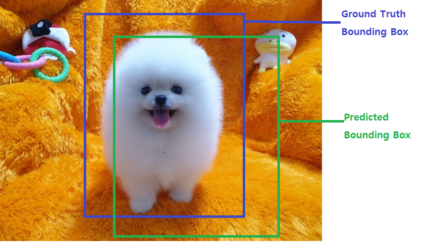
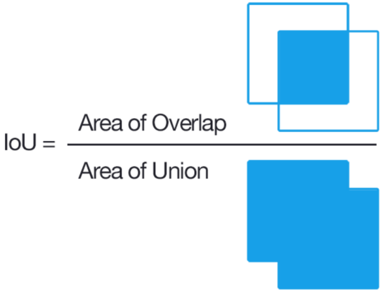
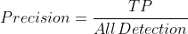
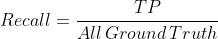
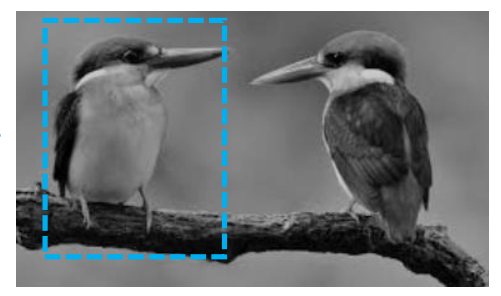
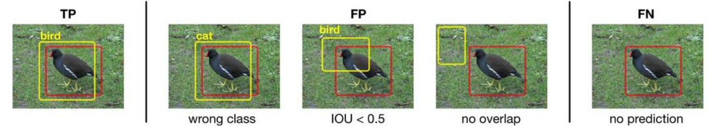
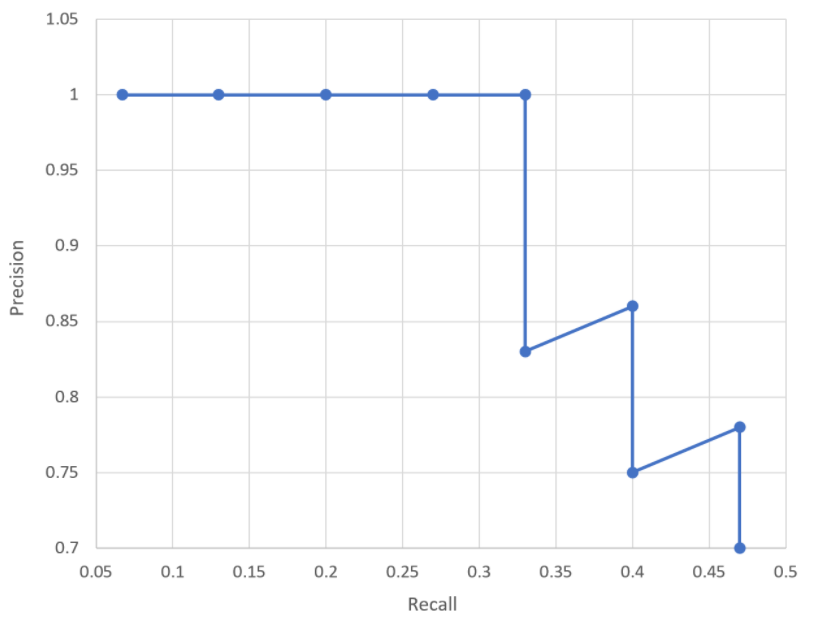
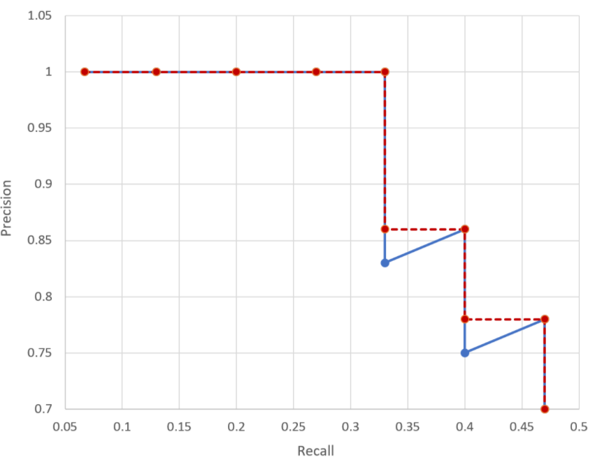

# ObjectDection 성능 평가

## IoU (Intersection Over Union, Jaccard overlap)
- 모델이 예측한 Bounding Box(bbox)와 Ground Truth Bounding Box(정답)가 얼마나 겹치는지를(Overlap) 나타내는 평가 지표
    - 두개의 Bounding Box가 일치할 수록 1에 가까운 값이 나오고 일치하지 않을 수록 0에 가까운 값
    
- 일반적으로 특정 IoU값을 기준으로 그 이상이면 검출한 것으로 미만이면 잘못찾은 것으로 생각해 제거
    - 이 기준이 되는 값이 IoU Threshold(임계값)
    - 일반적으로 0.5 수치는 ground truth와 66.% 이상 겹쳐(overlap)되야 나오는 수치 이면 사람의 눈으로 봤을때 잘 찾았다고 느껴지는 수준
   

    
    

## mAP (mean Average Precision)
- 여러개의 실제 Object가 검출된 재현율(Recall)의 변화에 따른 정밀도(Precision) 값을 평균화 한 것
- precision-recall curve, AP(Average Precision)는 Object Detection(물체 검출) 알고리즘 성능 평가를 위해 사용되는 방법

### Precision(정밀도)와 Recall(재현율)
- 정밀도는 Positive로 예측한 것 중 실제 Positive인 것의 비율. (Positive로 예측한 것이 얼마나 맞았는지의 수치)
    - Object Detection에서는 Detect(검출) 예측결과가 실제 Object(물체)들과 얼마나 일치하는지를 나타내는 지표

    

- 재현율은 실제 Positive인 것 중 Positive로 예측한 것의 비율. (Positive인 것을 얼마나 맞았는지의 수치)
    - Object Detection에서는 실제 Object(물체)들을 얼마나 잘 Detect(검출) 했는지를 나타내는 지표

    

    

> 두마리 새 중 한마리만 Detect
> - 1개를 예측해서 1개 맞았으므로 Precision은 100%(1.0)
> - 새는 두 마리인데 하나만 Detect(검출) 했으므로 Recall은 50%(0.5)

### Object Detection에서 TP, FP, FN

    
    red box: Ground truth, yellow box: prediction

> - FP : 잘못 detection (classification, localization, 둘다 잘못)  
> - FN : 아예 찾지 않는 것 

### precision과 recall의 trade off(반비례관계)
> **Confidence threshold:** 
>   - 지정된 값 이상의 confidence를 가진 결과만 예측결과로 사용하고 그 이하인 것들은 무시 
>   - 이 값을 0.5로 설정하면 confidence score가 0.5 미만인 결과(0.1,0.2,0.3등)는 무시
>   - 이 값은 하이퍼파라미터이다. 

- ### confidence threshold를 높게 잡은 경우
    - 확신의 정도가 아주 높은 경우만 검출하기 때문에 예측한 것이 얼마나 맞았는지에 대한 지표인 **Precision지표는 높은 값**
    - 확신의 정도가 낮으면 detect하지 않으므로 실제 물제를 얼만큼 검출했는지에 대한 지표인 **recall지표는 낮은 값**
- ### confidence threshold를 낮게 잡은 경우
    - 확신의 정도가 낮은 것들도 예측 했으므로 잘못 검출한 결과가 많아지므로 **Precision지표는 낮은 값**
    - 낮은 확신의 정도인 것들도 검출하기 때문에 실제 물체를 더 많이 검출하게 되어 **recall 지표가 높은 값**
- ### 정리    
    - **confidence threshold를 낮게** 잡으면 precision은 낮게 recall은 높게 나옴
        - recall이 올라가면 precision은 낮아짐.
    - **confidence threshold를 높게** 잡으면 precision은 높게 recall은 낮게 나옴
        - precision이 올라가면 recall은 낮아짐

- Precision과 Recall 반비례 관계
    - Precision과 Recall의 성능 변화 전체를 확인해야 함
        - 대표적인 방법 :  precision-recall curve 

### Precision-Recall curve
- confidence threshold의 변화에 따라 recall과 precision의 값이 변화
- **recall이 변화할때 precision이 어떻게 변하는지**를 선그래프로 나타낸 것을 Precision-Recall curve
- Object Detection 알고리즘의 성능을 성능을 평가하는 방법으로 많이 사용

    <b>Precision-Recall curve의 예</b>
    

### Average Precision (AP)
- precision-recall curve 그래프는 알고리즘의 성능을 전반적으로 파악하기에는 좋으나 서로 다른 알고리즘들의 성능을 정량적으로 비교하기 어려움 
- precision-recall curve 그래프를 하나의 scalar 값으로 나타낸 것이 Average precision(AP) 
- Average precision는 precision-recall curve 그래프의 선 아래 면적을 계산한 값

- Average precision이 높을수록 그 알고리즘의 성능이 전체적으로 우수하다는 의미
- Object Detection 알고리즘의 성능은 대부분 Average precision으로 평가

    

 
> - Average Precision 값은 위의 그림과 같이 Precision-recall curve의 선을 단조적으로 감소하는 그래프로 바꾼 면적

### mAP (mean Average Precision)
- mAP는 검출해야하는 Object가 여러개인 경우 각 클래스당 AP를 구한 다음 그것을 모두 합해 클래스 개수로 나눈 값
    - 클래스들의 AP의 평균
- 대부분의 알고리즘은 mAP를 이용해 Detection 성능을 평가  
